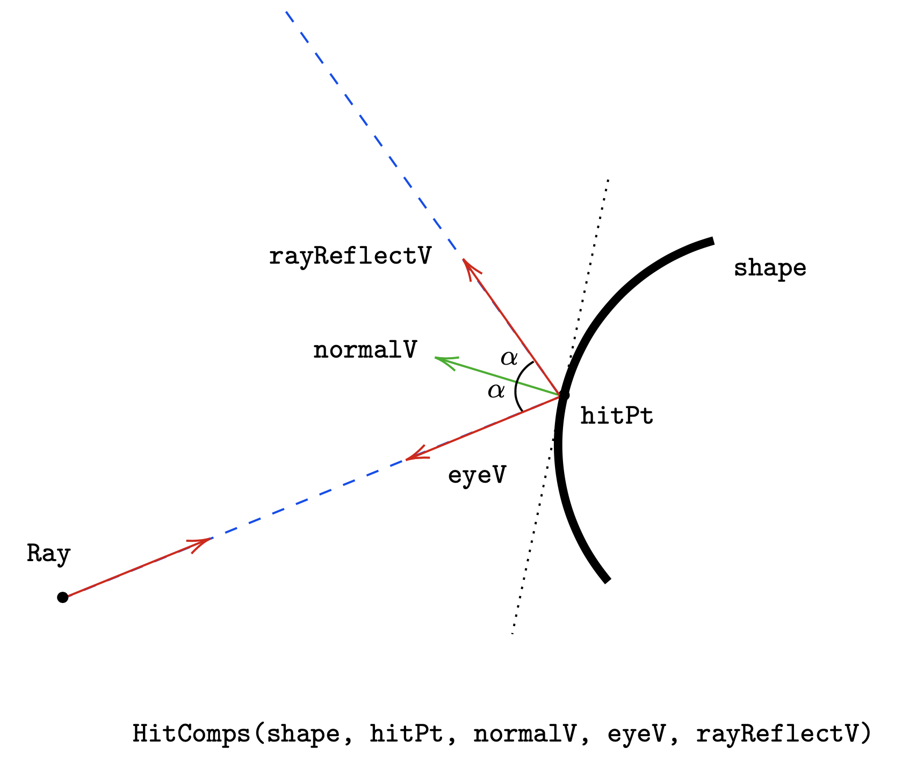

# Ray tracing with environmental effects and ZIO

For an introduction to environmental effects, please refer to ZIO documentation, especially the [overview](https://zio.dev/docs/overview/overview_index) and the [module pattern](https://zio.dev/docs/howto/howto_use_module_pattern) sections.

# Building a ray tracer
A ray tracer simulates the behavior of rays of light as they hit the objects in a world, ending up hitting a camera sensors. There are a number of resources on the web to build ray tracers, but I followed [The Ray Tracer Challenge](https://pragprog.com/book/jbtracer/the-ray-tracer-challenge).

Since most of the rays acting upon a scene don't hit the camera, the most efficient process is to see how rays _outgoing_ from a camera hit the objects in the world, and then see how those rays actually originated, taking into account multiple effects such as shadows, light reflection and diffusion, and world reflection on reflective surfaces.

All rays and objects are described in terms of euclidean space, the space of points and vectors, and transformations such as translate, rotate, scale. 

We will implement a simple ray tracer using ZIO environmental effects, to demonstrate how we can build a true onion architecture application, and test it completely relying solely on functional effects.

To start, the data type modelling a ray is simply a pair of a point (origin) and a vector saying where it's going. We also want to be able to describe all possible hits of a ray, therefore we equip it with the `positionAt(t)` function. 

```scala
case class Ray(origin: Pt, direction: Vec) {
  def positionAt(t: Double): Pt = origin + (direction * t)
}
```

## 1. Create a camera
A camera in a 3d space is completely described by its resolution (`hRes`, `vRes`), the point where it is located (`viewFrom`), the point it is looking at (`viewTo`) and the direction of the vector "looking up" the camera, to distinguish how the camera is rotated. Moreover, the aperture angle of the camera determines uniquely the distance between the "eye" and the camera itself (see Fig 1)


In terms of code we can create a camera through a method with this signature (`UIO` is an effect that can't fail and doesn't need any environment to be provided in order to run):

```scala
object Camera {
  def make(viewFrom: Pt, viewTo: Pt, upDirection: Vec, visualAngleRad: Double, hRes: Int, vRes: Int): UIO[Camera] = ???
}
```

This will create a(n `UIO` of a) `case class Camera( hRes: Int, vRes: Int, fieldOfViewRad: Double, tf: AT)`. While the first 3 parameters are obvious, what's the `tf` for? Actually, it is handy to start from a camera in a standard position (looking at the negative z axis, being located in the origin, looking up on the y axis), which we will call _canonical camera_. Any camera in the world (positioned in any arbitrary position, looking to an any point, oriented in any way) can be defined in terms of a transformation operated on the canonical camera. We take the _inverse_ of that transformation, and we carry it together with the camera. E.g. if I translate the camera to the point `Pt(0, 0, -5)` the transformation that must be carried along with our camera will be the transformation that must be applied to the world, in order to produce the same effect if the camera was the canonical one. That means if the real camera is positioned at `Pt(0, 0, -5)` it is the same thing to have a canonical camera, with the whole world translated by pf +5 on the `z` axis, i.e. a `translate(0, 0, 5)` transformation. This transformation will be carried along with the camera object.


So we will start with the definition of a module that gives us the capability of applying, and defining, these transformations, that are called _affine transformations_ and are completely specified by a matrix 4 x 4.

### 1.1 Define an Affine Transformations module
Affine transformations can be applied both to points and vectors. With the convention that a point `Pt(x, y, z)` is represented by a column vector $`[x, y, z, 1]^T`$, and a vector `Vec(x, y, z)` is represented by a vector $`[x, y, z, 0]`$, given an affine transformation matrix, applying that transformation to the vector or point means simply multiplying the transformation matrix by the vector representing the `Vec` or the `Pt`. To make things more efficient, given that often in our computations for every transformation we need the opposite one (think about changing perspective and observer relativity), we will compute the inverse at the moment of creation of an affine transformation.

```scala
abstract sealed case class AT private (direct: M, inverse: M) {
  def inverted: AT = AT(inverse, direct)
}
```

And then we need to define a module (i.e. a capability) that allows us to operate on these transformations. We will follow the ZIO convention in the module definition.

Let's start with the definition of the service for the module responsible of managing affine transformations, which resides in the module's companion object. Core methods define the capability of applying the affine transformation to vectors, points, and to compose 2 transformations. For the whole list of methods refer to the source code in the project.

```scala
object ATModule {
  trait Service[R] {
    def applyTf(tf: AT, vec: Vec): ZIO[R, AlgebraicError, Vec]
    def applyTf(tf: AT, pt: Pt): ZIO[R, AlgebraicError, Pt]
    def compose(first: AT, second: AT): ZIO[R, AlgebraicError, AT]
```

Then we define a trait `ATModule` with only one value named `aTModule` of type `Service[Any]` (the convention is to give to this `val` the same name of the module, with the first letter lowercased)

```scala
trait ATModule {
  val aTModule: ATModule.Service[Any]
}
```

In the companion object we define also an _accessor_ object that by convention will be named `>` to access the capabilities  of our `ATModule` from arbitrary locations

```scala
  object > extends Service[ATModule] {
    def applyTf(tf: AT, vec: Vec): ZIO[ATModule, AlgebraicError, Vec] =
      ZIO.accessM(_.aTModule.applyTf(tf, vec))
    def applyTf(tf: AT, pt: Pt): ZIO[ATModule, AlgebraicError, Pt] =
      ZIO.accessM(_.aTModule.applyTf(tf, pt))
    def compose(first: AT, second: AT): ZIO[ATModule, AlgebraicError, AT] =
      ZIO.accessM(_.aTModule.compose(first, second))
```

This is a very mechanical and repetitive operation (indeed automated by an annotation available in `zio-macros`) but it unlocks a very powerful thing. It allows us to access methods that express the dependency on the `ATModule`, from any place in our code, for example 

```scala
val rotatedPt: ZIO[ATModule, AlgebraicError, Pt] = for {
  rotateX <- ATModule.>.rotateX(math.Pi / 2) 
  res     <- ATModule.>.applyTf(rotateX, Pt(1, 1, 1))
} yield  res
```


### 1.2 Implement a Live `ATModule`

Now that we have specified the abstract part of our module, we need to provide at least one implementation of it. In the project, I defined a module `MatrixModule` that can handle operations on matrices of arbitrary dimensions, therefore it will be able to perform the simple multiplications of our 4 x 4 matrices (affine transformations) by vectors 4 x 1 (points and vectors). Our live implementation of `ATModule` has a dependency on a `MatrixModule`. There are many options to express this dependency, one is relying on arrows that can be expressed as `ZIO[MatrixModule, Nothing, ATModule]`, but the simplest way is just declaring a field of type `MatrixModule.Service[Any]` that adheres to the naming convention (`matrixModule` is the name of the `val` for the service of `MatrixModule`)

```scala
trait Live extends ATModule {
    val matrixModule: MatrixModule.Service[Any]

    val aTModule: ATModule.Service[Any] = new ATModule.Service[Any] {
      import vectorizable.comp

      override def applyTf(tf: AT, vec: Vec): ZIO[Any, AlgebraicError, Vec] =
        for {
          col    <- PointVec.toCol(vec)
          colRes <- matrixModule.mul(tf, col)
          res    <- PointVec.colToVec(colRes)
        } yield res
```

The consequence of this is that given a computation that requires an `ATModule`, once provided with a `Live` implementation through `provide`, the compiler  will signal clearly which dependency is missing, and our naming convention makes it straightforward for us to provide the missing one

```scala
rotatedPt.provide(new ATModule.Live{})
// Compiler error:
// object creation impossible, since value matrixModule in trait Live of type io.tuliplogic.raytracer.geometry.matrix.MatrixModule.Service[Any] is not defined
// [error]   rotatedPt.provide(new ATModule.Live{})
```

This error can be solved just by providing an implementation of the `MatrixModule` as suggested by the compiler, so we provide a Breeze-backed matrix operations module implementation, mixed in with our `ATModule`, and everything compiles.

```scala
rotatedPt.provide(new ATModule.Live with MatrixModule.BreezeMatrixModule{}) 
// Compiles!
```

### 1.3 Make a Camera
With the capability of applying affine transformations, it is relatively easy to create a `Camera`, once we compute the transformation to be embedded in the camera (and for that we just need `ATModule` capabilities)

```scala
 def make(viewFrom: Pt, viewTo: Pt, upDirection: Vec, visualAngleRad: Double, hRes: Int, vRes: Int): ZIO[ATModule, AlgebraicError, Camera] = for {
    cameraTf <- viewTransform(viewFrom, viewTo, upDirection)
  } yield new Camera(hRes, vRes, visualAngleRad, cameraTf)

  def viewTransform(from: Pt, to: Pt, up: Vec): ZIO[ATModule, AlgebraicError, AT] = ??? // one translation plus one orientation combined
```

# 2. Create a World
A world is just a set of shapes, and to produce nice images, spheres and planes are sufficient so these will be the only shapes we support. Like we did for the camera, we start defining 2 canonical shapes:
- a `Sphere.canonical` is defined as a sphere centered in the origin, of radius 1. As a set of points, $`\{(x, y, z) : x^2 + y^2 + z^2 = 1\}`$
- a `Plane.canonical` is the horizontal plane in our standard reference system, $`\{(x, y, z) : y = 0\}`$

Any other shape is represented as transformation applied to a canonical shape, so e.g. a Sphere centered in `Pt(0, 0, 5)` is represented as a `Sphere` equipped with a transformation to be applied to all the points of a canonical sphere, to produce the same sphere, it is clear that the transformation must simply be an `ATModule.translate(0, 0, 5)`. Same approach to describe generic planes.  

We provide also some utility methods to create uniform spheres, uniform planes, checker pattern planes etc. To build a world we also need a `PointLight` which can be simply defined as 

At the end of the day, all we need to build a world is (let's forget about colors of our spheres and planes for now)

```scala 
sealed trait SceneObject
case class Sphere(transformation: AT) extends SceneObject
case class Plane(transformation: AT) extends SceneObject

case class PointLight(position: Pt, intensity: Color)

case class World(pointLight: PointLight, objects: List[SceneObject])
```

# 3. Render a `World`
Rendering a world means scanning the grid of pixels of our camera, and produce a color for each pixel. To guarantee us maximal flexibility on how to manage those colored pixels, and considering the pixels to color can be pretty numerous, it is convenient to produce a stream of colored pixels.

We define our module `RasteringModule` as follows (I'm omitting the definition of the `trait RasteringModule` for brevity):

```scala
object RasteringModule {

  trait Service[R] {
    def raster(world: World, camera: Camera): ZIO[R, Nothing, ZStream[R, RayTracerError, ColoredPixel]]
  }
```

We can provide different implementations of this module, for example for testing it might be useful to have an all white result

```scala
trait AllWhiteTestRasteringModule extends RasteringModule {
  override val rasteringModule: Service[Any] = new Service[Any] {
    override def raster(world: World, camera: Camera): UIO[ZStream[Any, RayTracerError, ColoredPixel]] =
      UIO.succeed(for {
        x <- ZStream.fromIterable(0 to camera.hRes)
        y <- ZStream.fromIterable(0 to camera.vRes)
      } yield ColoredPixel(Pixel(x, y), Color.white))
  }
}
```

But for production we need to be able to simulate the real behavior of rays in our world, and this requires 2 capabilities:
1. Being able to produce one (outgoing) ray for every pixel in the camera
2. Calculate the color for that ray, considering all the possible effects (shadows, reflection, material, etc)

For each of these capabilities, we create a module, let's start with a module that given a camera and a pixel, is able to compute the ray for that pixel

```scala
object CameraModule {

  trait Service[R] {
    def rayForPixel(camera: Camera, px: Int, py: Int): ZIO[R, AlgebraicError, Ray]
  }
```

The live implementation for this is a bit verbose but not really complicated, and you can find it in the code together with some explanatory comments about the calculation logic.

For the calculation of the color for a given ray, we define the core module of our ray tracing application, the `WorldModule`

```scala
object WorldModule {
  trait Service[R] {
    def colorForRay(world: World, ray: Ray): ZIO[R, RayTracerError, Color]
```

Now, regardless of the implementations of `CameraModule` and `WorldModule`, we can provide a live implementation of our rastering module, that will depend on these 2 modules without bothering about their implementation. Here is an implementation that tries to exploit all the cores of our processor, but as I don't want to divert to a different topic (computation strategies with streams), the key point here is that for each point in our camera we are calling the 2 modules defined above  

```scala
trait ChunkRasteringModule extends RasteringModule {
    val cameraModule: CameraModule.Service[Any]
    val worldModule: WorldModule.Service[Any]

    val chunkSize: Int = 4096
    val parChunks: Int = 15 //nr cores - 1

    override val rasteringModule: Service[Any] = new Service[Any] {
      override def raster(world: World, camera: Camera): UIO[ZStream[Any, RayTracerError, ColoredPixel]] = {
          /* omitted code, see source */
          for {
            ray   <- cameraModule.rayForPixel(camera, px, py)
            color <- worldModule.colorForRay(world, ray)
          } yield ColoredPixel(Pixel(px, py), color)
          /* omitted code */
      }
    }
  }
```

### 3.1 Testing the rastering module
To unit test the rastering module, we make use of the mocking features provided by [`zio-test`](https://github.com/zio/zio/tree/master/test). In tagless final, to test functionally we would rely on state monad or `Ref` to load the mocks and keep track of the calls being performed. For an example of this strategy in Tagless Final see [here](https://github.com/profunktor/console4cats/blob/master/core/src/test/scala/cats/effect/ConsoleSpec.scala), for a ZIO base done see [here](https://gist.github.com/jdegoes/dd66656382247dc5b7228fb0f2cb97c8). Basically the idea is to use the `Ref` as a mutable state to hold the "preload" of the mocks and as a tracker that the expected calls have been performed.

`Zio-test` generalizes this, and together with a couple of macro annotations it makes testing with mock straightforward, just follow these simple steps:

1. Define what you want to test, leaving out the dependencies on the services you want to mock, in this case we want to test that our rastering module produces the (stream containing the) expected list of `ColoredPixel`

```scala
 val appUnderTest: ZIO[RasteringModule, RayTracerError, List[ColoredPixel]] =
        RasteringModule.>.raster(world, camera).flatMap(_.runCollect)
```

You can see that this effect needs to be provided with the implementation of `RasteringModule` we want to test

2. Annotate the _modules_ (not the services!!!) you want to mock with `@mockable` 

```scala
@mockable
trait CameraModule { ... }

@mockable
trait WorldModule { ... }
```

3. In the unit test, prepare your mocks by defining the `Expectations` for the methods you want to mock, e.g. here we specify that when the call to `WorldModule.colorForRay` is done with `world, r1, 5` input, it should return `Color.red` 

```scala
  val colorForRayExp = (WorldModule.colorForRay(equalTo((world, r1, 5))) returns value(Color.red)) *>
    (WorldModule.colorForRay(equalTo((world, r2, 5))) returns value(Color.green))

  val rayForPixelExp = CameraModule.rayForPixel(equalTo((camera, 0, 0))) returns value(r1)) *>
      (CameraModule.rayForPixel(equalTo((camera, 0, 1))) returns value(r2))
```

Expectations are pure values and monads, so we can combine them, zip them like we are used to with other structures

4. Provide the `appUnderTest` with a managed environment build using the expectations we just built 

```scala
appUnderTest.provideManaged(
  worldModuleExp.managedEnv.zipWith(cameraModuleExp.managedEnv) { (wm, cm) =>
    new ChunkRasteringModule {
      override val cameraModule: CameraModule.Service[Any] = cm.cameraModule
      override val worldModule: WorldModule.Service[Any] = wm.worldModule
        }
      }
    )
```

1. Assert on the result
```scala
assert(res, equalTo(List(
  ColoredPixel(Pixel(0, 0), Color.red),
  ColoredPixel(Pixel(0, 1), Color.green),
  ColoredPixel(Pixel(1, 0), Color.blue),
  ColoredPixel(Pixel(1, 1), Color.white),
  ))
)
```

_Observation_: The fact that we provide our dependencies with a `Managed` rather than just an environment, making sure that the `release` process of the `Managed` is executed no matter what happens in the tests. The `release` will take care of asserting that all the mocks have been called as expected.

### 3.2 Implementing the `WorldModule`
The key method in the `WorldModule` is

```scala
def colorForRay(world: World, ray: Ray, remaining: Int = 5): ZIO[Any, RayTracerError, Color]
```

To provide a sensible implementation of this module we need to find the intersection between a ray and the objects in the world, and then consider how the light acts on that intersection when interacting with the material.

#### 3.2.1 Implementing `WorldTopologyModule`
In this module we calculate he `intersections` between the ray and the objects in the world, in order to determine which object in the world is emitting that ray towards our camera. This will be computed by the `WorldTopologyModule`. Among all the intersections, the one we are particularly interested in is the first one hit by the ray. `Intersection` carries the object hit by the ray, together with the value of `t` parameter

```scala
  case class Intersection(t: Double, sceneObject: Shape)
```

The implementation of the `intersections`  method just delegates the determination of the (possible) intersection between a ray and an object to a `RayModule` which, based on the shape, determines if the ray intersects the shape.

```scala
  def intersections(world: World, ray: Ray): ZIO[Any, Nothing, List[Intersection]] =
    ZIO.traverse(world.objects)(rayModule.intersect(ray, _)).map(_.flatten.sortBy(_.t))
```

The live implementation of `RayModule` determines the intersection between a generic ray and a generic  sphere  by applying the inverse of the transformation that was applied to the sphere, to the ray, and then determine the intersection between this transformed ray and the _canonical sphere_, the spere centered in origin with unit radius. See the code for details.

This module also provides us with a way to see if a hit point on a shape is shadowed by another shape. A point is shadowed if the segment between the point and the point of light  intersects any other shape. In other words, we can consider a ray outgoing from the hit point towards the point of light and find possible intersections between that ray and the other shapes in our world. If there's a hit within the distance between the point and the point of light, it's in shadow.


In code:

```scala
def isShadowed(world: World, pt: Pt): ZIO[Any, Nothing, Boolean] =
  for {
    v        <- UIO(world.pointLight.position - pt)
    distance <- v.norm
    vNorm    <- v.normalized.orDie
    xs       <- intersections(world, Ray(pt, vNorm))
    hit      <- rayModule.hit(xs)
  } yield hit.exists(i => i.t > 0 && i.t < distance)
```

#### 3.2.2 Implementing `WorldHitCompsModule`

This module calculates the `hitComponents` for a ray hitting an object the  for the ray, i.e. the _geometrical_ characteristics that determine the ray behavior on the surface of our object:

```scala
HitComps(shape: Shape, hitPt: Pt, normalV: Vec, eyeV: Vec, rayReflectV: Vec)
```

_Note that we aren't yet dealing with material properties of the object_

The `WorldHitCompsModule` module will take care of computing these components for a given intersection. Notice that we pass one specific hit, plus the list of all the intersections computed for that ray, to cope with transparency rendering (more on that later) 

```scala
object WorldHitCompsModule {
  trait Service[R] {
    def hitComps(ray: Ray, hit: Intersection, intersections: List[Intersection]): ZIO[R, GenericError, HitComps]
  }
```



It is apparent from the image above that in order to calculate these components we must be able to compute the normal vector to the hitting point for a given surface, so we delegate this responsibility to a different module that calculates the normal, and the reflected vector

```scala
object NormalReflectModule {
  trait Service[R] {
    def normal(p: Pt, o: Shape): ZIO[R, Nothing, Vec]
    
    /**
     * This is a derived method in this service
     */
    final def reflect(vec: Vec, normal: Vec): ZIO[R, Nothing, Vec] =
      ZIO.succeed(vec - (normal * (2 * (vec dot normal))))
  }
```

With this module, looking at the picture above the `Live` implementation of the `HitComps` is pretty straightforward

```scala
  override def hitComps(ray: Ray, hit: Intersection, intersections: List[Intersection]): ZIO[Any, GenericError, HitComps] = {
    for {
      pt       <- UIO(ray.positionAt(hit.t))
      normalV  <- normalReflectModule.normal(pt, hit.sceneObject)
      eyeV     <- UIO(-ray.direction)
      reflectV <- normalReflectModule.reflect(ray.direction, normalV)
    } yield HitComps(hit.sceneObject, pt, normalV, eyeV, reflectV)
```


#### 3.2.3 Getting a first version to work
Let's put these little modules we wrote at work, by writing a simple function to put the colored pixels in a canvas

```scala
def drawOnCanvasWithCamera(world: World, camera: Camera, canvas: Canvas): ZIO[RasteringModule, RayTracerError, Unit] = for {
    coloredPointsStream <- RasteringModule.>.raster(world, camera)
    _                   <- coloredPointsStream.mapM(cp => canvas.update(cp)).run(Sink.drain)
  } yield ()
```

and then put it in our core program that will show us how the world look like from a given point of view

```scala
def program(viewFrom: Pt): ZIO[CanvasSerializer with RasteringModule with ATModule, RayTracerError, Unit] = for {
    camera <- cameraFor(viewFrom: Pt)
    w      <- world
    canvas <- RaytracingProgram.drawOnCanvasWithCamera(w, camera)
    _      <- CanvasSerializer.>.render(canvas, 255)
  } yield ()
```

The signature of this program tells us all the requirements it has, so we must provide it with such an environment. This is where our environment shines, in that we can compose dependencies using inheritance. We define first a minimal set of environments that are required by all our implementations:

```scala
trait BasicModules
  extends NormalReflectModule.Live
  with RayModule.Live
  with ATModule.Live
  with MatrixModule.BreezeMatrixModule
  with WorldModule.Live
  with WorldTopologyModule.Live
  with WorldHitCompsModule.Live
  with CameraModule.Live
  with RasteringModule.ChunkRasteringModule
  with Blocking.Live
  with Console.Live
```

No worries if this looks a bit daunting: I got to this point just by following the compiler suggestions (and your IDE can help as well):

```
[error] /Users/pierangelo.cecchetto/Documents/projects/scala/talks/ray-tracer-zio/ray-tracer/src/main/scala/io/tuliplogic/raytracer/ops/programs/SimpleWorld.scala:37:37: object creation impossible, since:
[error] it has 4 unimplemented members.
[error] /** As seen from <$anon: io.tuliplogic.raytracer.ops.model.modules.RasteringModule.ChunkRasteringModule with io.tuliplogic.raytracer.geometry.affine.ATModule.Live with io.tuliplogic.raytracer.ops.rendering.CanvasSerializer.PPMCanvasSerializer>, the missing signatures are as follows.
[error]  *  For convenience, these are usable as stub implementations.
[error]  */
[error]   // Members declared in zio.blocking.Blocking
[error]   val blocking: zio.blocking.Blocking.Service[Any] = ???
[error]   
[error]   // Members declared in io.tuliplogic.raytracer.ops.model.modules.RasteringModule.ChunkRasteringModule
[error]   val cameraModule: io.tuliplogic.raytracer.ops.model.modules.CameraModule.Service[Any] = ???
[error]   val worldModule: io.tuliplogic.raytracer.ops.model.modules.WorldModule.Service[Any] = ???
[error]   
[error]   // Members declared in io.tuliplogic.raytracer.geometry.affine.ATModule.Live
[error]   val matrixModule: io.tuliplogic.raytracer.geometry.matrix.MatrixModule.Service[Any] = ???
[error]   program(Pt(2, 2, -8)).provide(new RasteringModule.ChunkRasteringModule with ATModule.Live with CanvasSerializer.PPMCanvasSerializer {
```


We can compose a simple environment by addding inheritance on a black/white color provider, and we can close all the requirements for our program in our main zio `App`

```scala
  trait VerySimpleModules
  extends BasicModules
  with BlackWhiteColorModules

  override def run(args: List[String]): ZIO[ZEnv, Nothing, Int] =
  program(Pt(2, 2, -10))
    .provide {
      new CanvasSerializer.PPMCanvasSerializer with VerySimpleModules {
        override def path: Path = Paths.get(s"$canvasFile-$z.ppm")
      }
    }.foldM(err => console.putStrLn(s"Execution failed with: ${err}").as(1), _ => UIO.succeed(0))
```

This "grouping modules" is something that would be pretty difficult to achieve in tagless final: `program[F[_]: NormalReflectModule : RayModule : ATModule]` can't be grouped so easily.

In the `SimpleWorld` example you can find in the repo we  construct a simple world of 2 spheres, one huge one centered in the origin with radius 3, and a smaller one with radius 0.3, centered in `Pt(0, 0, -5)`. The point of light is along the at -15 on z axis. With our `BlackWhiteColorModules` we have a `black` pixel if the ray doesn't hit any shape or if the point being hit is shadowed by another shape, and a `white` in any other case, and we can already display an image where we can perceive our shapes and shadows

<div>


</div>

