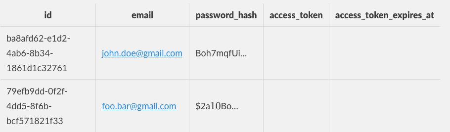
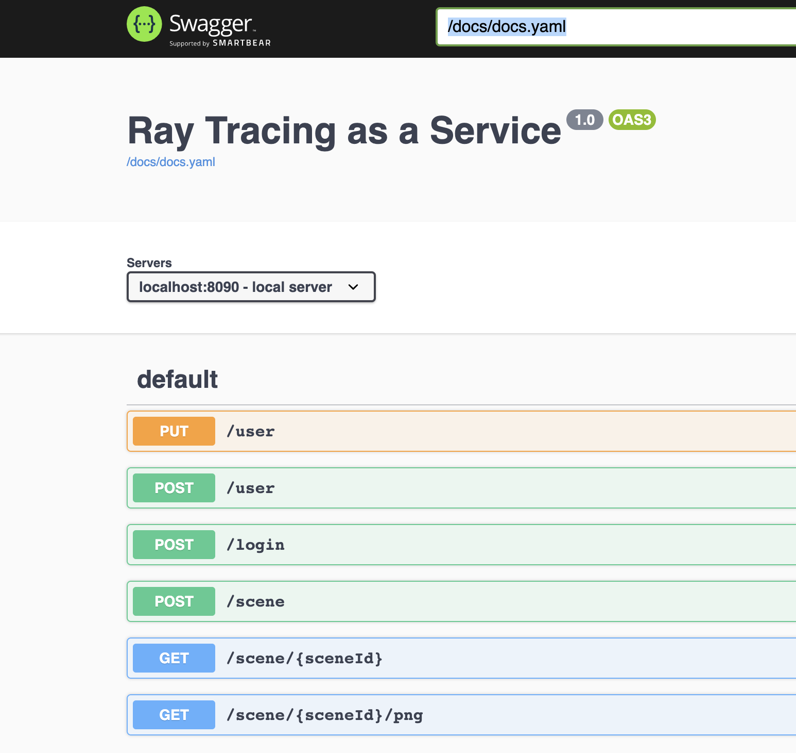
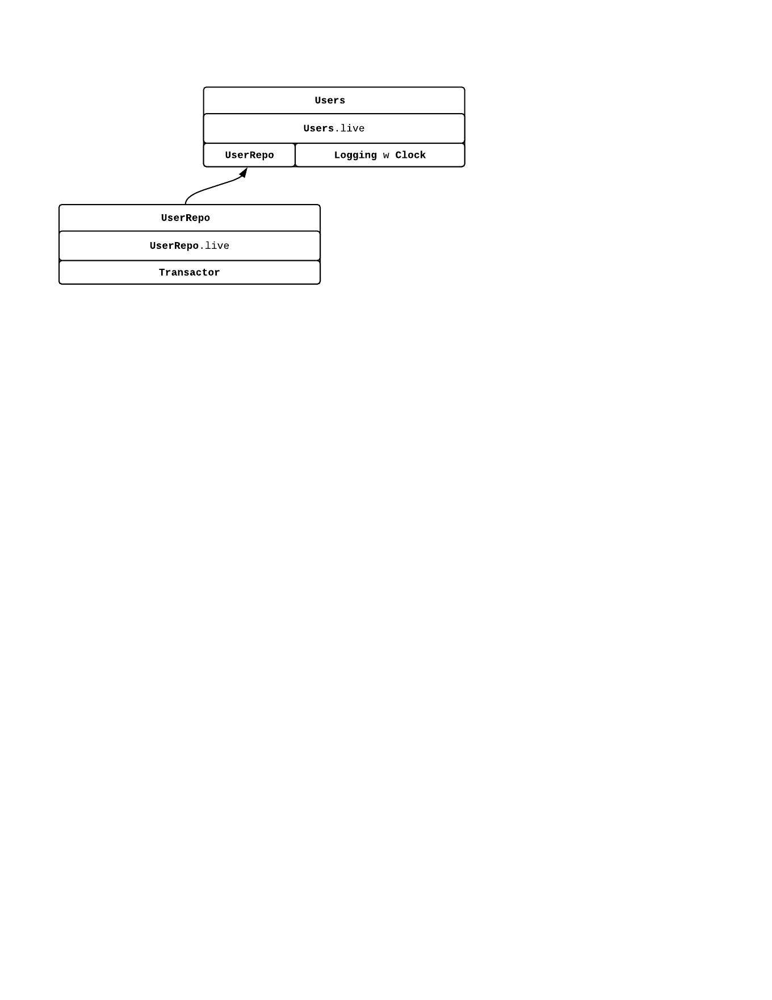
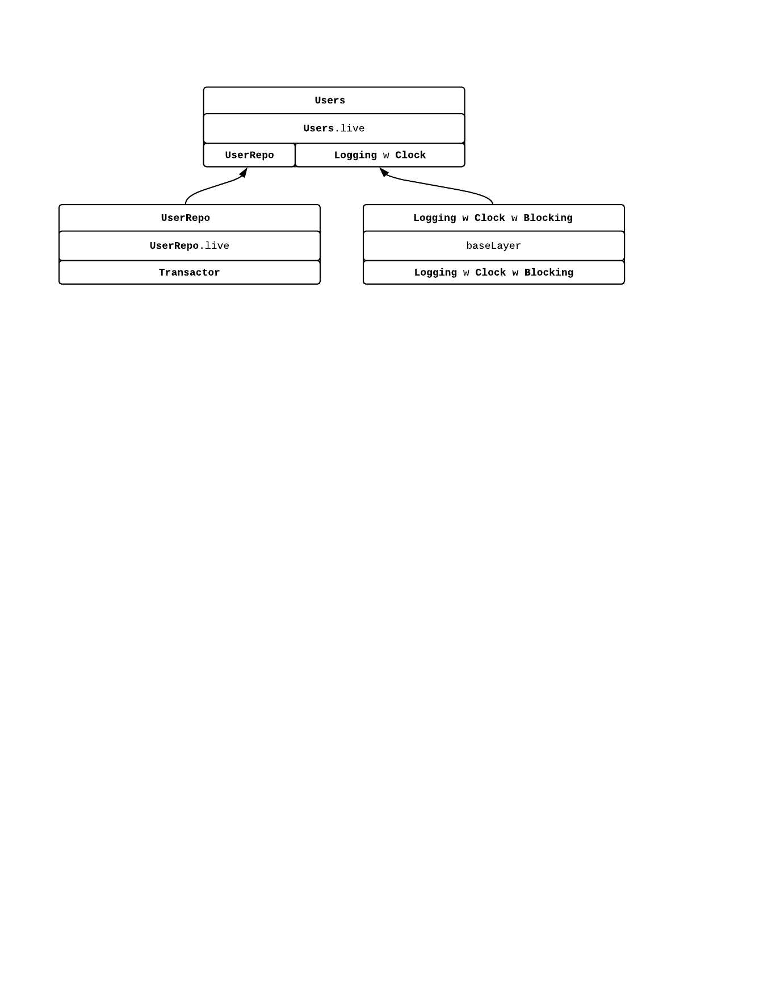
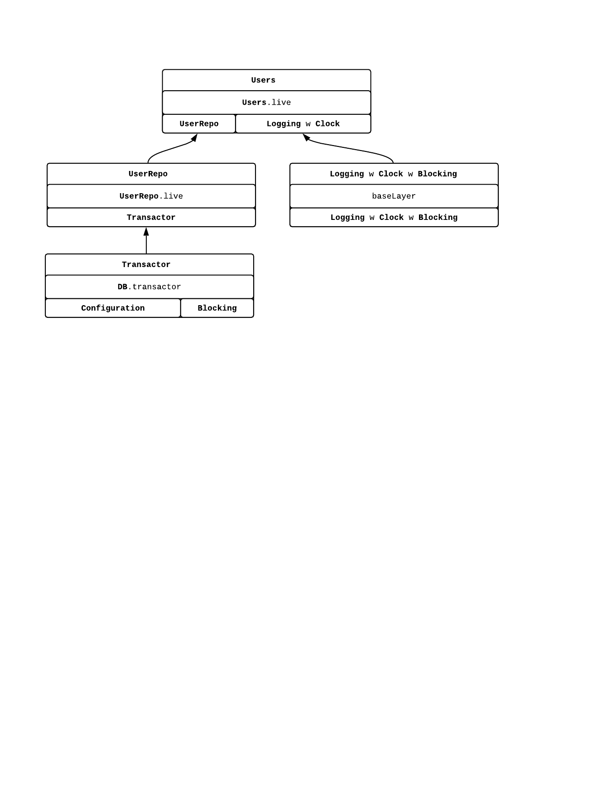
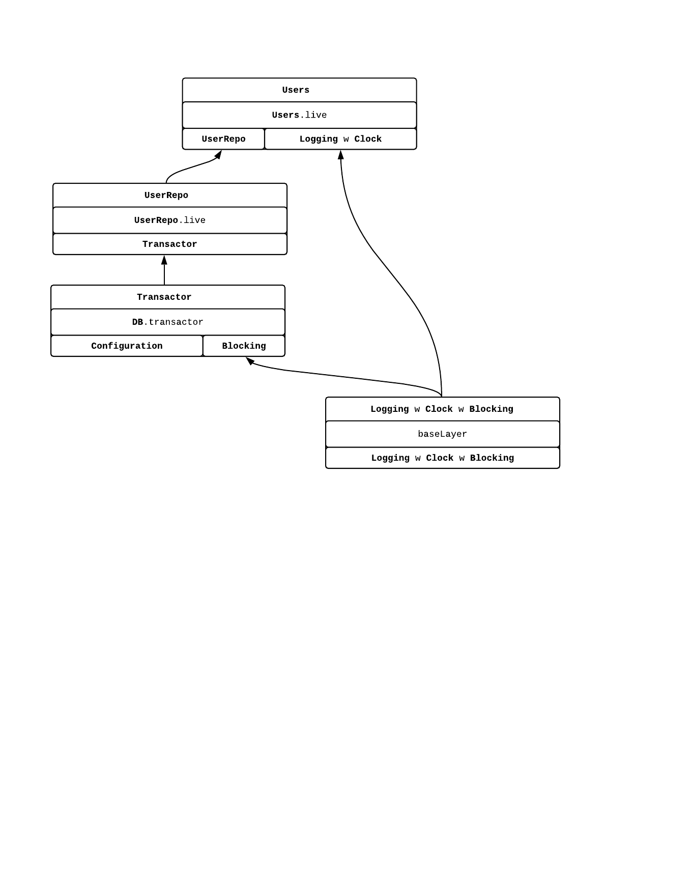
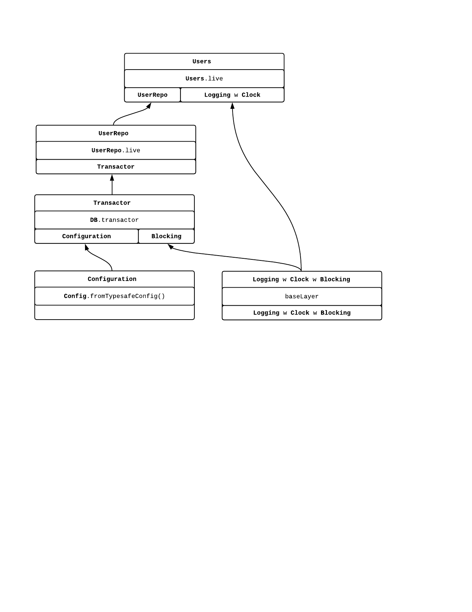
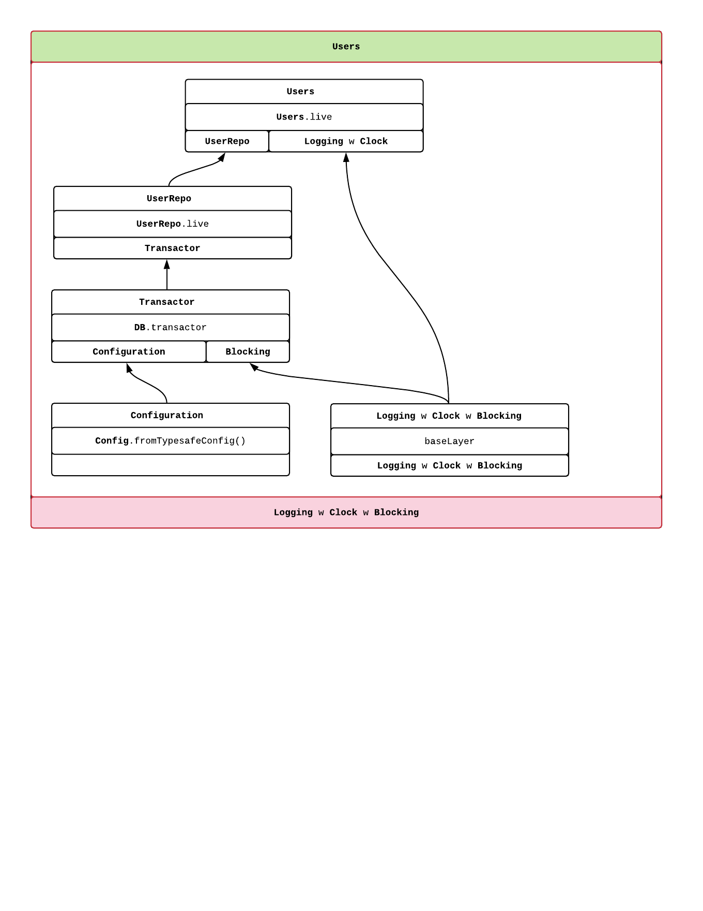

autoscale: true
slidenumbers: false
build-lists: true
list: alignment(left)
theme: Next, 3

^Plan for the talk: 
1. ZIO[R, E, A] lends to the module pattern
2. recipe for the module, show metrics example
3. Build a web application:
  - user management
  - image management
4. Show how to define `UserRepo` and then `UserService`
5. Routes with Tapir. Show how modul
3. Ray tracing problem
4. module for Transformations, relying on Matrix module (just signatures)
5. Module for camera, show rastering and testing
6. Show modules adding progressively
7. Show plugging in/out
8. Show http4s?


# `ZLayer`

## Build a web application
##### Pierangelo Cecchetto

<br/>

**LambdaConf 2020**
**18 August 2020**

<br/>
<br/>

 

---
# ZIO-101

```scala
ZIO[-R, +E, +A]

       ⬇

R => IO[Either[E, A]]

       ⬇

R => Either[E, A]
```

---
# ZIO-101: Programs

[.list: alignment(left)]
[.build-lists: true]

- ZIO programs are values
- Concurrency based on fibers (green threads)

[.code-highlight: none]
[.code-highlight: 1-4]
[.code-highlight: 1-6]
[.code-highlight: 1-8]
[.code-highlight: 1-10]
```scala
  val prg: ZIO[Console with Random, Nothing, Long] = for {
    n <- random.nextLong                    // ZIO[Random, Nothing, Long]
    _ <- console.putStrLn(s"Extracted $n ") // ZIO[Console, Nothing, Unit]
  } yield n
 
  val allNrs: ZIO[Console with Random, Nothing, List[Long]] = ZIO.collectAll(List.fill(100)(prg))
  
  val allNrsPar: ZIO[Console with Random, Nothing, List[Long]] = ZIO.collectAllPar(List.fill(100)(prg))
  
  val allNrsParN: ZIO[Console with Random, Nothing, List[Long]] = ZIO.collectAllParN(10)(List.fill(100)(prg))
```

---
# ZIO-101: `R` means _requirement_

[.code-highlight: none]
[.code-highlight: 1]
[.code-highlight: 1-3]
[.code-highlight: 1-5]

```scala
val prg: ZIO[Console with Random, Nothing, Long] = ???

val autonomous: ZIO[Any, Nothing, Long] = ???

val getUserFromDb: ZIO[DBConnection, Nothing, User] = ???
```

---
# ZIO-101: Requirements elimination

[.code-highlight: none]
[.code-highlight: 1]
[.code-highlight: 1-4]
[.code-highlight: 1-6]

```scala
val getUserFromDb: ZIO[DBConnection, Nothing, User] = ???

val provided: ZIO[Any, Nothing, User] = 
  getUserFromDb.provide(DBConnection(...))

val user: User = Runtime.default.unsafeRun(provided)
```

---
# ZIO-101: Useful Aliases

[.code-highlight: none]
[.code-highlight: 1]
[.code-highlight: 1-2]
[.code-highlight: 1-3]
[.code-highlight: 1-4]
[.code-highlight: 1-5]

```scala
type IO[+E, +A]   = ZIO[Any, E, A]        
type Task[+A]     = ZIO[Any, Throwable, A]
type RIO[-R, +A]  = ZIO[R, Throwable, A]  
type UIO[+A]      = ZIO[Any, Nothing, A]  
type URIO[-R, +A] = ZIO[R, Nothing, A]    
```

---
# ZIO-101: Modules
Example: a module to collect metrics

[.code-highlight: 2-5] 
[.code-highlight: 1-5] 
[.code-highlight: all] 
```scala
type Metrics = Has[Metrics.Service]
object Metrics {
  trait Service {
    def inc(label: String): IO[Nothing, Unit]
  }

  //accessor method
  def inc(label: String): ZIO[Metrics, Nothing, Unit] =
      ZIO.accessM(_.get.inc(label))
  }
}
```

---
# ZIO-101: Modules
Example: a module for logging

```scala
type Log = Has[Log.Service]
object Log {
  trait Service {
    def info(s: String): IO[Nothing, Unit]
    def error(s: String): IO[Nothing, Unit]
  }

  //accessor methods...
}
```
---
# ZIO-101: Modules
Write a program using existing modules, i.e. _program to an interface_

```scala
val prg: ZIO[Metrics with Log, Nothing, Unit] = 
  for {
    _ <- Log.info("Hello")
    _ <- Metrics.inc("salutation")
    _ <- Log.info("LambdaConf")
    _ <- Metrics.inc("subject")
  } yield ()
```

---

# ZIO-101: The `Has` data type

`Has[A]` is a dependency on a value of type `A`

[.code-highlight: none] 
[.code-highlight: all] 
```scala
val hasLog: Has[Log.Service]         // type Log     = Has[Log.Service]
val hasMetrics: Has[Metrics.Service] // type Metrics = Has[Metrics.Service]
val mix: Log with Metrics = hasLog ++ hasMetrics

//access each service
mix.get[Log.Service].info("Starting the application")
```

---

# ZIO-101: The `Has` data type

^From the compiler POV, the types we are building are types mixins, so they play well with contravariance on the R
But under the hood we have the capability to re-access the single components

```scala
val mix: Log with Metrics = hasLog ++ hasMetrics

mix.get[Log.Service].info("Starting the application")
```

- To the compiler this looks like trait mixin 
- Plays well with `ZIO[-R, _, _]`
- Is backed by a heterogeneus map `ServiceType -> Service`
- Can replace/update services

---

# ZIO-101: `ZLayer`

```scala
ZLayer[-RIn, +E, +ROut]
```

- A recipe to build an `ROut`
- Backed by `ZManaged`: safe acquire/release
- `type Layer[+E, +ROut] = ZLayer[Any, E, ROut]`
- `type ULayer[+ROut]    = ZLayer[Any, Nothing, ROut]`


---

# ZIO-101: `ZLayer`

Construct from value

```scala
val layer: ULayer[UserRepo] = 
  ZLayer.succeed(new UserRepo.Service)
```
---
# ZIO-101: `ZLayer`

Construct from function

```scala
val layer: URLayer[Connection, UserRepo] = 
  ZLayer.fromFunction { c: Connection =>
    new UserRepo.Service
  }
```

---
# ZIO-101: `ZLayer`

Construct from effect

```scala
import java.sql.Connection

val e: ZIO[Connection, Error, UserRepo.Service]

val layer: ZLayer[Connection, Error, UserRepo] = 
  ZLayer.fromEffect(e)
```

---
# ZIO-101: `ZLayer`

Construct from resources

```scala
import java.sql.Connection

val connectionLayer: Layer[Nothing, Has[Connection]] = 
  ZLayer.fromAcquireRelease(makeConnection) { c =>
     UIO(c.close())
  }
```

---
# ZIO-101: `ZLayer`

Construct from other services

```scala
val usersLayer: URLayer[UserRepo with UserValidation, BusinessLogic] = 
  
  ZLayer.fromServices[UserRepo.Service, UserValidation.Service] { 
    (repoSvc, validSvc) =>
      new BusinessLogic.Service {
        // use repoSvc and validSvc
      }
    }
```

---
# ZIO-101: `ZLayer`

Compose horizontally
(_all inputs for all outputs_)

```scala
val l1: ZLayer[Connection, Nothing, UserRepo]
val l2: ZLayer[Config, Nothing, AuthPolicy]

val hor: ZLayer[Connection with Config, Nothing, UserRepo with AuthPolicy] =
  l1 ++ l2
```


---
# ZIO-101: `ZLayer`

Compose vertically
(_output of first for input of second_)

```scala
val l1: ZLayer[Config, Nothing, Connection]
val l2: ZLayer[Connection, Nothing, UserRepo]

val ver: ZLayer[Config, Nothing, UserRepo] =
  l1 >>> l2
```

---
# ZIO-101: `ZLayer`
Provide required module to a program

[.code-highlight: 1] 
[.code-highlight: 1-3] 
[.code-highlight: 1-5] 
[.code-highlight: 1-7] 
```scala
val p: ZIO[Metrics, Nothing, Unit] = Metrics.inc("LambdaConf")

Metrics.live: ULayer[Metrics]

val runnable: ZIO[Any, Nothing, Unit] = p.provideLayer(Metrics.live)

Runtime.default.unsafeRun(runnable)
```


[.code-highlight: 1-3] 
[.code-highlight: 1-5] 
[.code-highlight: 1-7] 
---
# ZIO-101: `ZLayer`
`ZIO` uses ZLayer to provide the basic modules, all bundled in `ZEnv`

```scala
package object console {
  type Console = Has[Console.Service]
}

val p: URIO[Console, Unit] = zio.console.putStrLn("Hello world")

Runtime.default.unsafeRun(p)
```


---
^Let's have a quick digression on what is FP
FP can be seen through the guarantee of RT
or through Immutability
But what actually gives FP power from the operational point of view, that subsumes the 2 properties above, is its compositionality

# Digression

- What is FP?
  - Referential Transparency :+1:
  - Immutability :+1:
  - Modularity and composability! :rocket:
- `ZLayer` is a tool to compose dependency trees of arbitrary complexity, with strong resource management guarantees

---

# Build a simple application

Given: A module that computes a png from scene description[^1] 

```scala
case class SceneBundle(world: World, viewFrom: Pt, viewTo: Pt) // a bit simplified

object PngRenderer {

  trait Service {
    def draw(scene: SceneBundle): UIO[Chunk[Byte]]
  }

  def draw(scene: SceneBundle): URIO[PngRenderer, Chunk[Byte]] =
    ZIO.accessM(_.get.draw(scene))

  val live: URLayer[CanvasSerializer with RasteringModule with ATModule, PngRenderer] = ???
}
```

[^1]: left over from a previous PoC about ZIO modularity

---

# A simple application

- Wrap in http layer
- Minimal user management
- Users can fetch their scenes after authentication

---

#### User Management / UserRepo

```scala
object UsersRepo {

  trait Service {
    def createUser(user: User): IO[DBError, Unit]
    def getUser(userId: UserId): IO[DBError, Option[User]]
    def getUserByEmail(email: Email): IO[DBError, Option[User]]
    def getUserByAccessToken(email: AccessToken): IO[DBError, Option[User]]
    def updatePassword(userId: UserId, newPassword: PasswordHash): IO[DBError, Unit]
    def updateAccessToken(
      userId: UserId, newAccessToken: AccessToken, expiresAt: ZonedDateTime
    ): IO[DBError, Unit]
  }

  /* and accessor methods */
```

---

#### User Management / UserRepo

[.code-highlight: 1-4] 
[.code-highlight: 1-8] 
[.code-highlight: all] 
```scala
val live: URLayer[DB.Transactor, UsersRepo] =
  ZLayer.fromService[HikariTransactor[Task], UsersRepo.Service] { 
    transactor =>
    new Service {

      def getUser(userId: UserId): IO[DBError, Option[User]] = {
        Queries.getUser(userId)
          .option.transact(transactor)
          .mapError(e => 
            DBError(s"Error fetching user with id = $userId", Some(e))
          )
      }
    }
  }
```

```scala
object Queries {
  def getUser(userId: UserId): Query0[User] =
    sql"""select * from users
          |  where id = ${userId.value}
          """.stripMargin.query[User]
}
```




---

#### User Management / Service

```scala
object Users {
  
  case class UserCreated(userId: UserId)
  case class PasswordUpdated(userId: UserId)
  case class LoginSuccess(userId: UserId, accessToken: AccessToken)

  trait Service {
    def createUser(email: Email): IO[APIError, UserCreated]
    def updatePassword(email: Email, newPassword: ClearPassword): IO[APIError, PasswordUpdated]
    def login(userEmail: Email, givenPassword: ClearPassword): IO[APIError, LoginSuccess]
  }
```

---

#### User Management / Service

[.code-highlight: 1-7] 
[.code-highlight: 1-11] 
[.code-highlight: 1-7, 12-14] 
[.code-highlight: 1-7, 15-16] 
[.code-highlight: 1-7, 17] 
[.code-highlight: 1-7, 22] 
```scala
val live: URLayer[UsersRepo with Logging with Clock, Has[Service]] =
  ZLayer.fromServices[UsersRepo.Service, Logger[String], Clock.Service, Service] { (usersRepo, logger, clock) =>

  new Service {

    def login(userEmail: Email, clearPassword: ClearPassword): IO[APIError, LoginSuccess] =
        for {
          user <- usersRepo.getUserByEmail(userEmail).catchAll(e =>
            logger.throwable("DB error fetching user by email", e) *>
              ZIO.fail(APIError("Couldn't fetch user"))
          ).some.mapError(_ => APIError("User not found"))
          pwdHash   <- user.password.fold[IO[APIError, PasswordHash]](
              ZIO.fail(APIError("Password not set for user, cannot authenticate"))
            )(ZIO.succeed(_))
          newToken  <- createToken(clearPassword, pwdHash)
          now       <- clock.instant
          _ <- usersRepo.updateAccessToken(user.id, newToken, now.atZone(ZoneId.of("UTC")))
                .catchAll { dbErr => 
                  logger.throwable("DB Error updating access token", dbErr)
                    .as(APIError("Could not update access token, you must login again"))
                }
        } yield LoginSuccess(user.id, newToken)
```

---
^Let's go now to the Http layer definition. For this, my tool of choice is TAPIR.
First of, it adheres to the functional design principles of composability and modularity. Endpoints are values

#### Http Layer

Tapir: **endpoints as values**

```scala
val login: Endpoint[Login, APIError, LoginSuccess, Nothing] =
  endpoint.post.in("login").in(jsonBody[Login]).out(jsonBody[LoginSuccess]).errorOut(jsonBody[APIError])
    .description("Login to obtain an access token")
```

---
^The first thing we can do with this, is have documentation for free

#### Http Layer

Tapir: OpenAPI  **documentation for free**

```scala
val openApiDocs: OpenAPI = Seq(
  ...
  endpoints.login,
  ...
).toOpenAPI("Ray Tracing as a Service", "1.0")
  .servers(List(Server("localhost:8090").description("local server")))

val docsRoutes: HttpRoutes[Task] = new SwaggerHttp4s(openApiDocs.toYaml).routes[Task]
```



---

^Sencondly, Tapir has a fabulous integration with ZIO
#### Http Layer

Tapir: Integration with ZIO

[.code-highlight: 1-5] 
[.code-highlight: 1-8] 
[.code-highlight: 1-9] 
[.code-highlight: 1-14] 
```scala
// bind endpoint with module
val loginWithLogic: ZServerEndpoint[Users, Login, APIError, LoginSuccess] =
  endpoints.login.zServerLogic(login =>
    Users.login(login.email, login.password)
  )

//make HttpRoutes for http4s
val loginRoute:    URIO[Users, HttpRoutes[Task]]  = loginWithLogic.toRoutesR
val getSceneRoute: URIO[Scenes, HttpRoutes[Task]] = getSceneWithLogic.toRoutesR

val serve: RIO[Users with Scenes with Logging, Unit] = for {
  allRoutes <- ZIO.mergeAll(List(loginRoute, getSceneRoute))(docsRoutes)(_ <+> _)
  _         <- serveRoutes(allRoutes)
} yield ()
```

---

^Only in the main we provide layer
#### Putting things together

```scala
val program: ZIO[Users 
  with Logging 
  with Transactor 
  with Scenes, BootstrapError, Unit] =
  for {
    _ <- log.info("Running Flyway migration...")
    _ <- DB.runFlyWay
    _ <- log.info("Flyway migration performed!")
    _ <- serve.mapError(e => 
           BootstrapError("Error starting http server", Some(e))
         )
  } yield ()

override def run(args: List[String]): URIO[zio.ZEnv, ExitCode] =
  program.provideCustomLayer(???)
```

---
^As usual, follow the types!
#### Putting things together

[.code-highlight: 1-4] 
[.code-highlight: 6-7] 
[.code-highlight: 6-11] 
```scala
val program: ZIO[Users 
  with Logging 
  with Transactor 
  with Scenes, BootstrapError, Unit] = ???

val program: ZIO[Users, 
  BootstrapError, Unit] =  ???

Users.live: URLayer[UsersRepo 
  with Logging 
  with Clock, Users]
```


---
^As usual, follow the types!
#### Putting things together

[.code-highlight: 1-3] 
[.code-highlight: 1-5]
```scala
Users.live: URLayer[UsersRepo 
  with Logging 
  with Clock, Users]

UsersRepo.live: URLayer[DB.Transactor, UsersRepo] = ???

type AppEnv = Blocking with Clock with Logging
val baseLayer = ZLayer.identity[AppEnv]

val usersLayer: ZLayer[Transactor with AppEnv, AppError, Users] =
(UsersRepo.live ++ baseLayer) >>> Users.live
```



---
^As usual, follow the types!
#### Putting things together
[.code-highlight: 1-8] 
[.code-highlight: 1-11]
```scala
Users.live: URLayer[UsersRepo 
  with Logging 
  with Clock, Users]

UsersRepo.live: URLayer[DB.Transactor, UsersRepo] = ???

type AppEnv = Blocking with Clock with Logging
val baseLayer = ZLayer.identity[AppEnv]

val usersLayer: ZLayer[Transactor with AppEnv, AppError, Users] =
(UsersRepo.live ++ baseLayer) >>> Users.live

```



---
^As usual, follow the types!
#### Putting things together

```scala
Users.live: URLayer[UsersRepo 
  with Logging 
  with Clock, Users]

UsersRepo.live: URLayer[DB.Transactor, UsersRepo] = ???

type AppEnv = Blocking with Clock with Logging
val baseLayer = ZLayer.identity[AppEnv]

val usersLayer: ZLayer[Transactor with AppEnv, AppError, Users] =
(UsersRepo.live ++ baseLayer) >>> Users.live

DB.transactor: ZLayer[Blocking with Configuration, DBError, Transactor] = ???
```



---
^As usual, follow the types!
#### Putting things together

```scala
Users.live: URLayer[UsersRepo 
  with Logging 
  with Clock, Users]

UsersRepo.live: URLayer[DB.Transactor, UsersRepo] = ???

type AppEnv = Blocking with Clock with Logging
val baseLayer = ZLayer.identity[AppEnv]

val usersLayer: ZLayer[Transactor with AppEnv, AppError, Users] =
(UsersRepo.live ++ baseLayer) >>> Users.live

DB.transactor: ZLayer[Blocking with Configuration, DBError, Transactor] = ???
```



---
^As usual, follow the types!
#### Putting things together

```scala
Users.live: URLayer[UsersRepo 
  with Logging 
  with Clock, Users]

UsersRepo.live: URLayer[DB.Transactor, UsersRepo] = ???

type AppEnv = Blocking with Clock with Logging
val baseLayer = ZLayer.identity[AppEnv]

val usersLayer: ZLayer[Transactor with AppEnv, AppError, Users] =
(UsersRepo.live ++ baseLayer) >>> Users.live

DB.transactor: ZLayer[Blocking with Configuration, DBError, Transactor] = ???

val transactorLayer: ZLayer[Blocking, AppError, Transactor] = 
(Config.fromTypesafeConfig() ++ ZLayer.identity[Blocking]) >>> DB.transactor
```



---
^As usual, follow the types!
#### Putting things together

[.code-highlight: 1-19] 
[.code-highlight: 1-22] 
[.code-highlight: all] 
```scala
Users.live: URLayer[UsersRepo 
  with Logging 
  with Clock, Users]

UsersRepo.live: URLayer[DB.Transactor, UsersRepo] = ???

type AppEnv = Blocking with Clock with Logging
val baseLayer = ZLayer.identity[AppEnv]

val usersLayer: ZLayer[Transactor with AppEnv, AppError, Users] =
(UsersRepo.live ++ baseLayer) >>> Users.live

DB.transactor: ZLayer[Blocking with Configuration, DBError, Transactor] = ???

val transactorLayer: ZLayer[Blocking, AppError, Transactor] = 
(Config.fromTypesafeConfig() ++ ZLayer.identity[Blocking]) >>> DB.transactor

val fullLayer: ZLayer[AppEnv, AppError, Users] = 
(transactorLayer ++ baseLayer) >>> usersLayer

val program: ZIO[Users, 
  BootstrapError, Unit] =  ???

val runnable: ZIO[AppEnv, 
  AppError, Unit] = program.provideLayer(fullLayer)
```



---

# Demo time!

---

# Unit testing
Test `Users.live`, mocking dependency on `UsersRepo`

[.code-highlight: 1] 
[.code-highlight: 1-9] 
[.code-highlight: 1-11] 
[.code-highlight: 1-13] 
[.code-highlight: all] 
```scala
val live: URLayer[UsersRepo with Logging with Clock, Users] = ???

//mock
val userRepo: URLayer[Has[Ref[Map[UserId, User]]], UsersRepo] = ZLayer.fromService (users =>
    new UsersRepo.Service {
      def getUser(userId: UserId): IO[AppError.DBError, Option[User]] =
        users.get.map(_.find(_._1 == userId).map(_._2))
      /* ... */
    })

val usersRepoLayer: ULayer[UsersRepo] = ZLayer.fromEffect(Ref.make(Map(testUser.id -> testUser))) >>> userRepo
val slf4jLogger: ULayer[Logging] = ???

//Test assertion:
(
  for {
    loginOutput <- Users.login(Email("aeinstein@research.com"), ClearPassword("pwd123"))
  } yield assert(loginOutput.userId)(equalTo(testUser.id))
).provideSomeLayer((slf4jLogger ++ usersRepoLayer ++ ZLayer.identity[Clock]) >>> Users.live)
   


```


---

### Conclusion - **ZLayer**
[.text: alignment(left)]

- Dependency graph in the code 💪
- Type safety, no magic, full control 🙌
- Compiler helps to satisfy requirements 🤗
- Resource safety 🦺
- Easy to onboard 😊

---

# **Thank you!**

 @pierangelocecc

 https://github.com/pierangeloc/ray-tracer-zio
