autoscale: true
slidenumbers: false
build-lists: true
list: alignment(left)
theme: Fira, 3

^Plan for the talk: 
1. ZIO[R, E, A] lends to the module pattern
2. recipe for the module, show metrics example
3. Ray tracing problem
4. module for Transformations, relying on Matrix module (just signatures)
5. Module for camera, show rastering and testing
6. Show modules adding progressively
7. Show plugging in/out
8. Show http4s?


# `ZLayer`


## A ray tracing exercise

<br/>
Amsterdam Scala
28 Feb 2020
<br/>
<br/>

 

<!--

---
^A couple of words about myself

# 👋

### Pierangelo Cecchetto

### Scala Consultant - Amsterdam

[.text: alignment(left)]

 @pierangelocecc

 https://github.com/pierangeloc

---
^In this talk we'll talk about ZIO environment, and how to use it to described a layered set of computations where each type of computatoni is delegated to a specific component
* We'll see how to combine components and test their interactions in a purely functional way
* And all this will be an excuse to learn not only ZIO but how a ray tracer works 
* We will not cover all the fancy things zio offers such as concurrency, cancellation, fibers. They will be used behind the scenes but we don't discuss them here

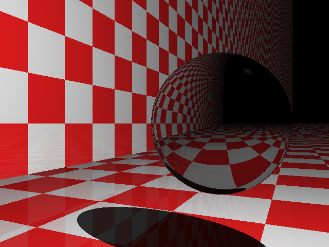 

[.text: alignment(left)]
### This talk
- **Is about**
 - ZIO environment
 - Testing
 - How ray tracing works
 
- **Is not about**
 - Errors, Concurrency, fibers, cancellation, runtime
 


---
^The agenda for the talk:
* We'll cover the bare minimum knowledge of zio to understand the meaning of the environment
* Build quickly the foundations to manage rays
* Build the components to build a ray tracer
* Test these components
* Wire things together
* Make pictures nicer
# Agenda

1. Build Ray Tracer components
1. Test Ray Tracer components
1. Wiring things together
1. Improving rendering

---
# ZIO - 101


[.code-highlight: 1-4]
[.code-highlight: 1-6]
[.code-highlight: 1-10]
```scala
import zio.console

val hello =
  console.putStrLn("Hello Functional Scala!!!") 

val runtime: Runtime[ZEnv] = new DefaultRuntime {}

runtime.unsafeRun(hello)

// > Hello Functional Scala!!! 
```


---
# ZIO - 101

^If we look at our simple program, we see that the type has 3 parameters, the environment, the error channel and the output channel
ZIO is parameterized in 3 types, the environment, the error channel and the output channel. As a mental model, think of it as a ... which can be further simplified as ... One important thing is that it is contravariant in the environment, and covariant on the E,A 

[.code-highlight: 1-2]
[.code-highlight: 1-4]
[.code-highlight: 1-8] 
[.code-highlight: 1-12] 
```scala
val hello: ZIO[Console, Nothing, Unit] =
  console.putStrLn("Hello Functional Scala!!!") 

ZIO[-R, +E, +A]

       ⬇

R => IO[Either[E, A]]

       ⬇

R => Either[E, A]
```
<!--

---
# ZIO - 101

^What does it mean when we see ZIO[Console, Nothing, Unit]?

```scala
val hello: ZIO[Console, Nothing, Unit] =
  console.putStrLn("Hello Functional Scala!!!") 
```

- Needs a `Console` to run
- Doesn't produce any error
- Produce `()` as output


---
# ZIO - 101

^In the first slide we cheated a bit. Our program could not be run. Actually a generic ZIO runtime is not able to run a program that requires console.
* The process to run an environmental effect is to satisfy all its requirements, and then execute it 
* The way you satisfy the requirements is `provide`
* now we eliminated the requirement, and this is witnessed in the type
* now I can run this "autonomous" effect in a runtime that provides nothing
* if I try to run an effect with unsatisfied requirement in an runtime that provides less than required I get an error

[.code-highlight: 1-2] 
[.code-highlight: 1-5] 
[.code-highlight: 1-2, 6-7] 
[.code-highlight: 1-4, 6-8] 
[.code-highlight: 1-4, 6-9] 
[.code-highlight: 1-4, 6, 7, 10-13]
```scala
val hello: ZIO[Console, Nothing, Unit] =
  console.putStrLn("Hello Functional Scala!!!") 

val runtime: Runtime[ZEnv] = 
  new DefaultRuntime{}
val runtime: Runtime[Console with Clock with ...] = 
  new DefaultRuntime{}

defaultRuntme.unsafeRun(hello)
```

---
# ZIO - 101
### A tale of types

[.code-highlight: none] 
[.code-highlight: 1] 
[.code-highlight: 1-2] 
[.code-highlight: 1-5] 
[.code-highlight: 1-7] 
[.code-highlight: 1-11] 
```scala
val two: ZIO[Any, Nothing, Int] = ???
val two: UIO[Int] = ???

val parsedEmail: ZIO[Any, String, Email] = ???

val kubeDeploy: ZIO[Kube, String, Unit] = ???

val logAndDeploy: ZIO[Kube with Log, String, Unit] = ???
```

---
^ In general ZIO provides mechanisms to introduce/eliminate environemnts
# ZIO - 101
### Environment introduction/elimination

[.code-highlight: 1] 
[.code-highlight: 1-4] 
[.code-highlight: 1-7] 
[.code-highlight: 1-8] 
```scala
// INTRODUCE AN ENVIRONMENT
ZIO.access(f: R => A): ZIO[R, Nothing, A]

ZIO.accessM(f: R => ZIO[R, E, A]): ZIO[R, E, A]

// ELIMINATE AN ENVIRONMENT
val kubeDeploy: ZIO[Kube, Nothing, Unit]
prg.provide(Kube.Live): ZIO[Any, Nothing, Unit]
```
---
^The R part in ZIO makes it very convenient to use the module pattern. We use modules to model capabilities. All capabilities in ZIO are modelled as modules
* All we need is to adhere to a simple naming convention
* Let's define a module that allows us to handle metrics counter incrementations.
* Module
* Service
* Accessor
Notice that we just defined an interface, or if you want an algebra
# ZIO-101: Module Pattern

### Module recipe

[.code-highlight: 1-4] 
[.code-highlight: 1-9] 
[.code-highlight: 1-16] 
```scala
// the module
trait Metrics {
  val metrics: Metrics.Service[Any] // named as the module
}
object Metrics {
  // the service
  trait Service[R] {
    def inc(label: String): ZIO[R, Nothing, Unit]
  }

  // the accessor
  object > extends Service[Metrics] {
    def inc(label: String): ZIO[Metrics, Nothing, Unit] =
      ZIO.accessM(_.metrics.inc(label))
  }
}
```

---
^Now we can write a program that uses our metrics module, and let's use it in conjunction with the console module
* SUPERB Type inference. Compiler is able to tell me that I need both these modules, I don't need to provide these capabilities beforehand like in TF
* Let's provide a live implementation that is backed by prometheus
* We can run it

# ZIO-101: Module Pattern
### `Metrics` and `Log` modules

[.code-highlight: 1-8] 
[.code-highlight: 1-15] 
[.code-highlight: 1-19] 
```scala
val prg: ZIO[Metrics with Log, Nothing, Unit] = 
  for {
    _ <- Log.info("Hello")
    _ <- Metrics.inc("salutation")
    _ <- Log.info("London")
    _ <- Metrics.inc("subject")
  } yield ()

trait Prometheus extends Metrics {
  val metrics = new Metrics.Service[Any] {
    def inc(label: String): ZIO[Any, Nothing, Unit] = 
      ZIO.effectTotal(counter.labels(label).inc(1))
  }
}

runtime.unsafeRun(
  prg.provide(new Metrics.Prometheus with Log.Live)
)
```

---
^Programs written in this style are completely testable. How do I unit test my program? I want to ensure that the counter gets called exactly once for "salutation" and once for "subject"
* The program remains the same value (data structure) we defined in first place 
* We define an implementation of the **SERVICE** backed by a data structure to handle state mutations
* We build an environment where the `Metrics` service is backed by this ref, and we provide it to our program, closing the requirements
* we run the test program, if this doesn't throw the test is green

# ZIO-101: Module Pattern
### **Testing**

```scala
val prg: ZIO[Metrics with Log, Nothing, Unit] = 
  for {
    _ <- Log.info("Hello")
    _ <- Metrics.inc("salutation")
    _ <- Log.info("London")
    _ <- Metrics.inc("subject")
  } yield ()
```

---

# ZIO-101: Module Pattern
### **Testing**

[.code-highlight: none] 
[.code-highlight: 1] 
[.code-highlight: 1-7] 
[.code-highlight: 1-13] 
[.code-highlight: 1-14] 
[.code-highlight: 1-16] 
[.code-highlight: 1-18] 
```scala
val prg: ZIO[Metrics with Log, Nothing, Unit] = /* ... */

case class TestMetrics(incCalls: Ref[List[String]]) 
  extends Metrics.Service[Any] {
  def inc(label: String): ZIO[Any, Nothing, Unit] =
    incCalls.update(xs => xs :+ label).unit
}

val test =  for {
  ref <- Ref.make(List[String]())
  _   <- prg.provide(new Log.Live with Metrics {
           val metrics = TestMetrics(ref)
         })
  calls <- ref.get
  _     <- UIO.effectTotal(assert(calls == List("salutation", "subject")))
} yield ()

runtime.unsafeRun(test)
```

-->

---
# ZIO-101

```scala
ZIO[-R, +E, +A]

       ⬇

R => IO[Either[E, A]]

       ⬇

R => Either[E, A]
```

---
# ZIO-101: Programs

[.list: alignment(left)]
[.build-lists: true]

- ZIO programs are values
- Concurrency based on fibers (green threads)

[.code-highlight: none]
[.code-highlight: 1-4]
[.code-highlight: 1-6]
[.code-highlight: 1-8]
[.code-highlight: 1-10]
```scala
  val prg: ZIO[Console with Random, Nothing, Long] = for {
    n <- random.nextLong                    // ZIO[Random, Nothing, Long]
    _ <- console.putStrLn(s"Extracted $n ") // ZIO[Console, Nothing, Unit]
  } yield n
 
  val allNrs: ZIO[Console with Random, Nothing, List[Long]] = ZIO.collectAll(List.fill(100)(prg))
  
  val allNrsPar: ZIO[Console with Random, Nothing, List[Long]] = ZIO.collectAllPar(List.fill(100)(prg))
  
  val allNrsParN: ZIO[Console with Random, Nothing, List[Long]] = ZIO.collectAllParN(10)(List.fill(100)(prg))
```

---
# ZIO-101: `R` means _requirement_

[.code-highlight: none]
[.code-highlight: 1]
[.code-highlight: 1-3]
[.code-highlight: 1-5]

```scala
val prg: ZIO[Console with Random, Nothing, Long] = ???

val autonomous: ZIO[Any, Nothing, Long] = ???

val getUserFromDb: ZIO[DBConnection, Nothing, User] = ???
```

---
# ZIO-101: Requirements elimination

[.code-highlight: none]
[.code-highlight: 1]
[.code-highlight: 1-4]
[.code-highlight: 1-6]

```scala
val getUserFromDb: ZIO[DBConnection, Nothing, User] = ???

val provided: ZIO[Any, Nothing, User] = 
  getUserFromDb.provide(DBConnection(...))

val user: User = Runtime.default.unsafeRun(provided)
```

---
# ZIO-101: Modules
Example: a module to collect metrics

[.code-highlight: 2-5] 
[.code-highlight: 1-5] 
[.code-highlight: all] 
```scala
type Metrics = Has[Metrics.Service]
object Metrics {
  trait Service {
    def inc(label: String): IO[Nothing, Unit]
  }

  //accessor method
  def inc(label: String): ZIO[Metrics, Nothing, Unit] =
      ZIO.accessM(_.get.inc(label))
  }
}
```

---
# ZIO-101: Modules
Example: a module for logging

```scala
type Log = Has[Log.Service]
object Log {
  trait Service {
    def info(s: String): IO[Nothing, Unit]
    def error(s: String): IO[Nothing, Unit]
  }

  //accessor methods...
}
```
---
# ZIO-101: Modules
Write a program using existing modules

```scala
val prg: ZIO[Metrics with Log, Nothing, Unit] = 
  for {
    _ <- Log.info("Hello")
    _ <- Metrics.inc("salutation")
    _ <- Log.info("Amsterdam")
    _ <- Metrics.inc("subject")
  } yield ()
```

---
# ZIO-101: The `Has` data type

`Has[A]` is a dependency on a service of type `A`

[.code-highlight: none] 
[.code-highlight: all] 
```scala
val hasLog: Has[Log.Service]         // type Log     = Has[Log.Service]
val hasMetrics: Has[Metrics.Service] // type Metrics = Has[Metrics.Service]
val mix: Log with Metrics = hasLog ++ hasMetrics

//access each service
mix.get[Log.Service].info("Starting the application")
```

---

# ZIO-101: The `Has` data type

```scala
val mix: Log with Metrics = hasLog ++ hasMetrics

mix.get[Log.Service].info("Starting the application")
```

- Is more powerful than trait mixins
- Is backed by a heterogeneus map `ServiceType -> Service`
- Can replace/update services

---

# ZIO-101: `ZLayer`

```scala
ZLayer[-RIn, +E, +ROut <: Has[_]]
```

- A recipe to build an `ROut`
- Backed by `ZManaged`: safe acquire/release
- `type NoDeps[+E, +B <: Has[_]] = ZLayer[Any, E, B]`

---

# ZIO-101: `ZLayer`

Construct from value

```scala
val layer: ZLayer.NoDeps[Nothing, UserRepo] = 
  ZLayer.succeed(new UserRepo.Service)
```
---
# ZIO-101: `ZLayer`

Construct from function

```scala
val layer: ZLayer[Connection, Nothing, UserRepo] = 
  ZLayer.fromFunction { c: Connection =>
    new UserRepo.Service
  }
```

---
# ZIO-101: `ZLayer`

Construct from effect

```scala
import java.sql.Connection

val e: ZIO[Connection, Error, UserRepo.Service]

val layer: ZLayer[Connection, Error, UserRepo] = 
  ZLayer.fromEffect(e)
```

---
# ZIO-101: `ZLayer`

Construct from resources

```scala
import java.sql.Connection

val connectionLayer: ZLayer.NoDeps[Nothing, Has[Connection]] = 
  ZLayer.fromAcquireRelease(makeConnection) { c =>
     UIO(c.close())
  }
```

---
# ZIO-101: `ZLayer`

Construct from other services

```scala
val usersLayer: ZLayer[UserRepo with UserValidation, Nothing, BusinessLogic] = 
  
  ZLayer.fromServices[UserRepo.Service, UserValidation.Service] { 
    (repoSvc, validSvc) =>
      new BusinessLogic.Service {
        // use repoSvc and validSvc
      }
    }
```

---
# ZIO-101: `ZLayer`

Compose horizontally
(_all inputs for all outputs_)

```scala
val l1: ZLayer[Connection, Nothing, UserRepo]
val l2: ZLayer[Config, Nothing, AuthPolicy]

val hor: ZLayer[Connection with Config, Nothing, UserRepo with AuthPolicy] =
  l1 ++ l2
```


---
# ZIO-101: `ZLayer`

Compose vertically
(_output of first for input of second_)

```scala
val l1: ZLayer[Config, Nothing, Connection]
val l2: ZLayer[Connection, Nothing, UserRepo]

val ver: ZLayer[Config, Nothing, UserRepo] =
  l1 >>> l2
```

---
# ZIO-101: `ZLayer`

Create module instances

[.code-highlight: 1-7] 
[.code-highlight: 1-14] 
[.code-highlight: 1-20] 
```scala
type UserRepo = Has[UserRepo.Service]

object UserRepo {
  trait Service {
    def getUser(userId: UserId): IO[DBError, Option[User]]
    def createUser(user: User): IO[DBError, Unit]
  }

  val inMemory: ZLayer.NoDeps[Nothing, UserRepo] = ZLayer.succeed(
    new Service {
      /* impl */
    }
  )

  val db: ZLayer[Connection, Nothing, UserRepo] = ZLayer.fromService { conn: Connection =>
    new Service {
      /* impl uses conn */
    }   
  }
}
```

---
# ZIO-101: `ZLayer`

Provide layers to programs

[.code-highlight: 1-2] 
[.code-highlight: 1-8] 
[.code-highlight: 1-12] 
[.code-highlight: 1-16] 
```scala
  import zio.console.Console 
  val checkUser: ZIO[UserRepo with AuthPolicy with Console, Nothing, Boolean]
  
  val liveLayer = UserRepo.inMemory ++ AuthPolicy.basicPolicy ++ Console.live

  val full: ZIO[Any, Nothing, Boolean] = checkUser.provideLayer(
    liveLayer
  )

  val partial: ZIO[Console, Nothing, Boolean] = checkUser.provideSomeLayer(
    UserRepo.inMemory ++ AuthPolicy.basicPolicy
  )

  val updated: ZIO[Any, Nothing, Boolean] = checkUser.provideLayer(
    liveLayer ++ UserRepo.postgres
  )
```

---

^In ray tracing we have 3 components: 
- The world (of spheres), and ambient light
- A Light source
- A Camera
- Reflected Rays
- Discarded rays
- Canvas 

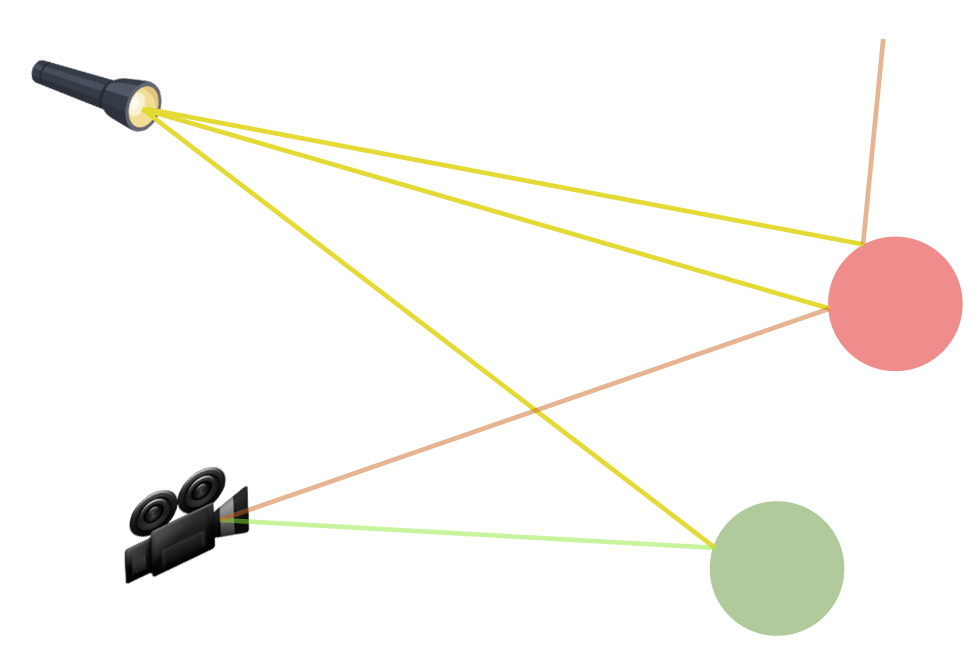 

# Ray tracing
[.list: alignment(left)]

- World (spheres), light source, camera
- Incident rays    
- Reflected rays

---
^To build an image we need a canvas, a rectangular surface divided in pixels where the rays coming from the world will hit and produce the color they carry in the ray

 

[.build-lists: false]

# Ray tracing
[.list: alignment(left)]

- World (spheres), light source, camera
- Incident rays    
- Reflected rays
- Discarded rays
- Canvas

---

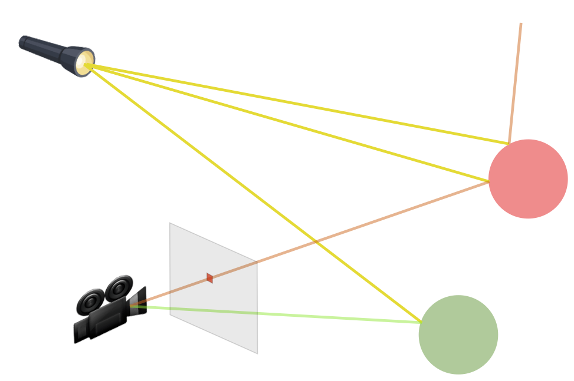 

[.build-lists: false]

# Ray tracing
[.list: alignment(left)]

- World (spheres), light source, camera
- Incident rays    
- Reflected rays
- Discarded rays
- Canvas
- Colored pixels

---

 

[.build-lists: false]

# Ray tracing
[.list: alignment(left)]

- World (spheres), light source, camera
- Incident rays    
- Reflected rays
- Discarded rays
- Canvas
- Colored pixels

---
^At this point we have 2 options, one is computing all the rays for all the objects, and then consider only those that hit the canvas
Another option is work on the reverse problem, i.e. have rays going out of the canvas, hitting the objects in the world and determine how they behave considering all the agents

 

# Ray tracing

Options:

[.list: alignment(left)]
1. Compute all the rays (and discard most of them)
1. Compute only the rays outgoing from the camera through the canvas, and determine how they behave on the surfaces

<!--
^Let's start building our model. A ray is an infinite line with a starting point. So let's start with the components we need to represent it, i.e. points and vectors

 

# Ray

A ray is defined by the point it starts from, and its direction

$$
P(t) = P_0 + t \vec{D},   t > 0 
$$

---

# Foundations
^ The foundations of this all are points and vectors, which are both represented by 3 numbers, but the difference is that vectors can be added with each othr, but points cannot. What you can do with points is add a vector to a point to get another point. And what you are building this way is an affine space

 

[.list: alignment(left)]
- Points and Vectors
- Transformations (rotate, scale, translate)

---
^ It's pretty easy to encode this in simple scala... and to verify that they satisfy the properties we just mentioned 

 


### Points and Vectors

[.code-highlight: 1-6]
[.code-highlight: 1-14]
```scala
case class Vec(x: Double, y: Double, z: Double) {
  def +(other: Vec): Vec   = 
    Vec(x + other.x, y + other.y, z + other.z)
  def unary_- : Vec = 
    Vec(-x, -y, -z)
}

case class Pt(x: Double, y: Double, z: Double) {
  def -(otherPt: Pt): Vec =
    Vec(x - otherPt.x, y - otherPt.y, z - otherPt.z)
  def +(vec: Vec)         = 
    Pt(x + vec.x, y + vec.y, z + vec.z)
}
```

---
^The first thing we do when we build our representation is to establish properties, so we write some PBT to check that 
* `(Vec, +)` form a group, 
* `(Vec, Pt, +, -)` form an affine space
* `approx` is due to double finite precision

 

### Points and Vectors

`zio-test` for PBT

[.code-highlight: 1-7]
[.code-highlight: 1-14]
```scala
testM("vectors form a group")(
  check(vecGen, vecGen, vecGen) { (v1, v2, v3) =>
    assertApprox  (v1 + (v2 + v3), (v1 + v2) + v3) &&
    assertApprox (v1 + v2 , v2 + v1) &&
    assertApprox (v1 + Vec.zero , Vec.zero + v1)
  }
),


testM("vectors and points form an affine space") (
  check(ptGen, ptGen) { (p1, p2) =>
    assertApprox (p2, p1 + (p2 - p1))
  }
)
```
-->

---
^once we define points and vectors, the definition of a ray is immediate:

 

### Ray

$$
P(t) = P_0 + t \vec{D},   t > 0 
$$

```scala
case class Ray(origin: Pt, direction: Vec) {
  def positionAt(t: Double): Pt =
    origin + (direction * t)
}
```

---
^ Provided 
* we have an AT type for our affine transformation 
* let's define a ZIO module to operate on  transformations, so we start defining a Service to apply them to point, vectors, and chain/compose them
* Define a trait that has a val with the same name of the module, pointing to the service we just created
* Define an object extending the Service, parameterized on the module itself. 
* The accessor creation is pretty repetitive and mechanical, so an annotation can do the boring stuff for us (the same way simulacrum does for typeclasses)

### Transformations Module

```scala
trait AT

type ATModule = Has[ATModule.Service]
object ATModule {
  /* Service */
  trait Service {
    def applyTf(tf: AT, vec: Vec): ZIO[ATError, Vec]
    def applyTf(tf: AT, pt: Pt): ZIO[ATError, Pt]
    def compose(first: AT, second: AT): ZIO[ATError, AT]
  }

  def applyTf(tf: AT, vec: Vec): ZIO[ATModule, ATError, Vec] =
    ZIO.accessM(_.aTModule.applyTf(tf, vec))
  def applyTf(tf: AT, pt: Pt): ZIO[ATModule, ATError, Pt] =
    ZIO.accessM(_.aTModule.applyTf(tf, pt))
  def compose(first: AT, second: AT): ZIO[ATModule, ATError, AT] =
    ZIO.accessM(_.aTModule.compose(first, second))
}
```

---
^ This accessor object allows us to summon our module wherever necessary, and build something like this, where I'm summoning capabilities from different modules, not only, but the compiler is able to infer and mix these capabilities for us
### Transformations Module

[.code-highlight: 1-26]
```scala
val rotatedPt = 
  for {
    rotateX <- ATModule.rotateX(math.Pi / 2)
    _       <- Log.info("rotated of π/2")
    res     <- ATModule.applyTf(rotateX, Pt(1, 1, 1))
  } yield  res
```
---

^ Show type inference
### Transformations Module

[.code-highlight: 1-26]
```scala
val rotatedPt: ZIO[ATModule with Log, ATError, Pt] =
  for {
    rotateX <- ATModule.rotateX(math.Pi / 2)
    _       <- Log.info("rotated of π/2")
    res     <- ATModule.applyTf(rotateX, Pt(1, 1, 1))
  } yield  res
```

---

^ Now we want to provide an implementation of this module. With an easy convention to translate vectors and points into 4-tuples, all we need is matrix multiplication  
### Transformations Module - Live

```scala
val rotated: ZIO[ATModule, ATError, Vec] = 
  for {
    rotateX <- ATModule.rotateX(math.Pi/2)
    res     <- ATModule.applyTf(rotateX, Pt(1, 1, 1))
  } yield res
```

[.list: alignment(left)]
- `Vec(x, y, z)`  $$ \Rightarrow [x, y, z, 0]^T$$ 

- `Pt(x, y, z)⠀`  $$ \Rightarrow [x, y, z, 1]^T$$ 

- ⠀
$$
\mathtt{rotated} = \begin{pmatrix}
\cos \pi/2 & -\sin \pi/2 & 0 & 0\\
\sin \pi/2 & \cos \pi/2 & 0 & 0\\
0 & 0 & 1 & 0 \\
0 & 0 & 0 & 1 \\
\end{pmatrix}
\begin{pmatrix}
x\\
y\\
z \\
0\\
\end{pmatrix}
$$

---

### Transformations Module - Live

$$
\mathtt{rotated} = \begin{pmatrix}
\cos \pi/2 & -\sin \pi/2 & 0 & 0\\
\sin \pi/2 & \cos \pi/2 & 0 & 0\\
0 & 0 & 1 & 0 \\
0 & 0 & 0 & 1 \\
\end{pmatrix}
\begin{pmatrix}
x\\
y\\
z \\
0\\
\end{pmatrix}
$$


```scala
val live: ZLayer[MatrixModule, Nothing, ATModule] = 
  ZLayer.fromService { matrixSvc =>
    new Service {
      def applyTf(tf: AT, vec: Vec) = 
        matrixSvc.mul(tf.direct, v)
      
      /* ...  */   
    }
}
```
---
^So now we have a tool that allows us to perform the std transformations on our points and vectors, so we are ready to build a camera

### Layer 1: Transformations


<!--

---
^The first thing to consider is that everything is relative. If my standard position as observer is x=0, and I want to see how things look like from x = -3, what I can do is translate the world of +3 and keep on sitting at x = 0. We call this the canonical position
### Camera 

##### Everything is relative!

 

- Canonical camera: observe always from `x = 0` and translate the world by `+3`

---
^In the same spirit, let's define our canonical camera

 

### Camera - canonical

[.code-highlight: 1-4, 6]
[.code-highlight: 1-6]
```scala
case class Camera (
  hRes: Int,
  vRes: Int,
  fieldOfViewRad: Double,
  tf: AT // world transformation
)
```

-->

---

### Camera
^Following the same reasoning we did with our camera translated in x=-3, we can generalize and build a generic camera by composing 2 transformations, one coping for the rotations, and one for the translations that brought our camera there. We have just to use the inverse because we will apply them to the world

 

[.code-highlight: 1-8]
[.code-highlight: 1-20]
```scala
object Camera {
  def make(
    viewFrom: Pt, 
    viewTo: Pt, 
    upDirection: Vec, 
    visualAngleRad: Double, 
    hRes: Int, 
    vRes: Int): 
    ZIO[ATModule, AlgebraicError, Camera] =
    worldTransformation(viewFrom, viewTo, upDirection).map { 
      worldTf => Camera(hRes, vRes, visualAngleRad, worlfTf)
    }
```

---

^For shapes we follow the same approach we followed for camera, canonical + transformation

### World
- `Sphere.canonical` $$ \{(x, y, z) : x^2 + y^2 + z^2 = 1\} $$
- `Plane.canonical` $$\{(x, y, z) : y = 0\} $$

[.code-highlight: none]
[.code-highlight: 1-4]
[.code-highlight: 1-6]
[.code-highlight: 1-7]
```scala
sealed trait Shape {
  def transformation: AT
  def material: Material
}

case class Sphere(transformation: AT, material: Material) extends Shape
case class Plane(transformation: AT, material: Material) extends Shape
```
---
^Let's see how we can make a generic sphere, a generic plane, and put them in the world

### World

##### Make a world

[.code-highlight: none]
[.code-highlight: 1-7]
[.code-highlight: 1-11]
[.code-highlight: 1-13]
```scala
object Sphere {
  def make(center: Pt, radius: Double, mat: Material): ZIO[ATModule, ATError, Sphere] = for {
    scale     <- ATModule.scale(radius, radius, radius)
    translate <- ATModule.translate(center.x, center.y, center.z)
    composed  <- ATModule.compose(scale, translate)
  } yield Sphere(composed, mat)
}

object Plane {
  def make(...): ZIO[ATModule, ATError, Plane] = ???
}

case class World(pointLight: PointLight, objects: List[Shape])
```

- Everything requires `ATModule`

---
^Rendering a world means producing an image that reprsents how the world looks like from our camera. So from the highest level I want to be able to produce a stream of colored pixels representing my image. So we define the module, make it accessible, and provide a trivial implementation that produces white pixels no matter what

### World Rendering - Top Down
#### Rastering - Generate a stream of colored pixels

```scala
type RasteringModule = Has[Service]
object RasteringModule {
  trait Service {
    def raster(world: World, camera: Camera): 
      Stream[RayTracerError, ColoredPixel]
  }
}
```

---
^Now what do we need to provide a LIVE implementation of this? We need to be able to provide one ray for each pixel of the camera, and for each ray we need to compute the color. Let's introduce 2 modules with these responsibilities

 

### World Rendering - Top Down
#### Rastering - **Live**

- Camera module - Ray per pixel

[.code-highlight: none]
[.code-highlight: all]
```scala
type CameraModule = Has[Service]
object CameraModule {
  trait Service {
    def rayForPixel(
      camera: Camera, px: Int, py: Int
    ): UIO[Ray]
  }
}
```

- World module - Color per ray

[.code-highlight: none]
[.code-highlight: all]
```scala
type WorldModule = Has[Service]
object WorldModule {
  trait Service {
    def colorForRay(
      world: World, ray: Ray
    ): IO[RayTracerError, Color]
  }
}
```

---
^And with these 2 modules we can provide a live implementation of the rastering logic. We declare dependencies on the *services* of our modules, and then we access them in the implmentation

### World Rendering - Top Down
#### Rastering **Live** - Module Dependency

[.code-highlight: 1-5]
[.code-highlight: 1-6]
[.code-highlight: all]
```scala
val chunkRasteringModule: ZLayer[CameraModule with WorldModule, Nothing, RasteringModule] =
  ZLayer.fromServices[cameraModule.Service, worldModule.Service, rasteringModule.Service] {
    (cameraSvc, worldSvc) =>
      new Service {
        override def raster(world: World, camera: Camera): 
          ZStream[Any, RayTracerError, ColoredPixel] = {
          val pixels: Stream[Nothing, (Int, Int)] = ???
          pixels.mapM{
            case (px, py) =>
              for {
                ray   <- cameraModule.rayForPixel(camera, px, py)
                color <- worldModule.colorForRay(world, ray)
              } yield data.ColoredPixel(Pixel(px, py), color)
          }
      }
    }
  }
```

---
^So the takeaway of this is...

### Layers

#### Takeaway
#### Implement and test every layer only in terms of the immediately underlying layer

---
^And now that we got warmed up with this, let's go on and implement all the logic through modules

 

---
^We can go on and fragment our logic in modules small enough to be tested and thought of in isolation

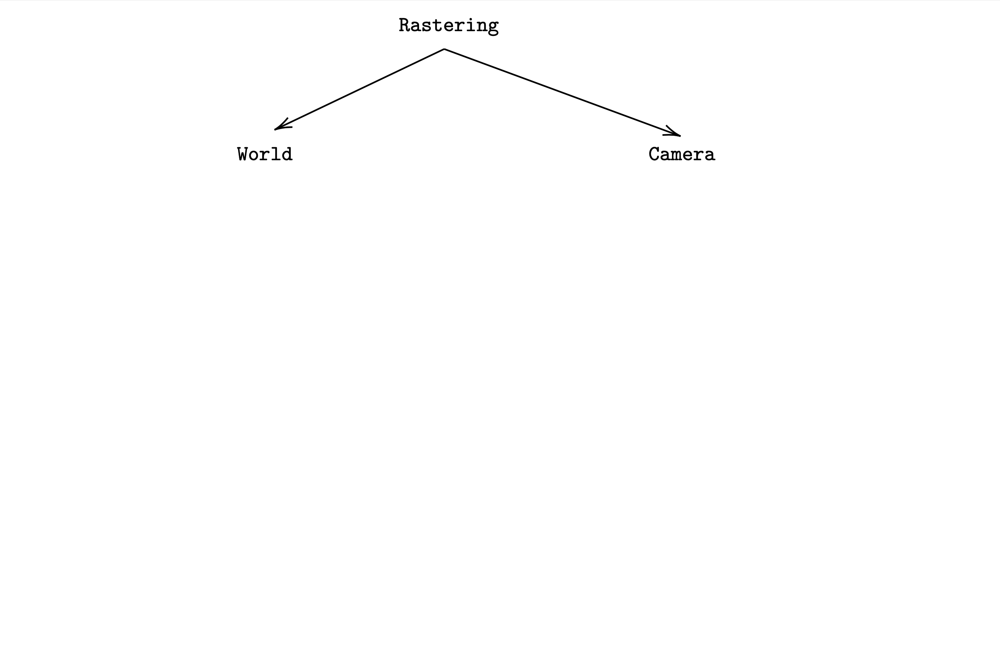 

### Live **CameraModule**

```scala
object CameraModule {
  val live: ZLayer[ATModule, Nothing, CameraModule] = 
    ZLayer.fromService { atSvc => 
      /* ... */
    }
}
```

---
^And implement the world module

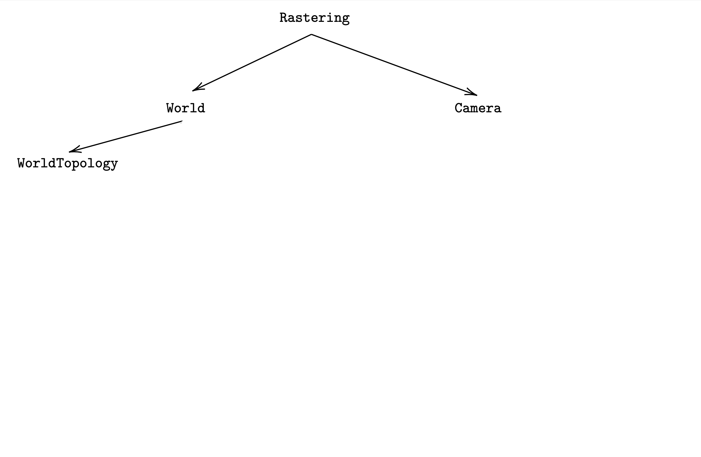 
### Live **WorldModule**
#### **WorldTopologyModule**

[.code-highlight: none]
```scala
object WorldTopologyModule {
  trait Service {
    def intersections(world: World, ray: Ray): 
      UIO[List[Intersection]]
    
    def isShadowed(world: World, pt: Pt): 
      UIO[Boolean]
  }  
}
```
---
^World topology module solves this problem

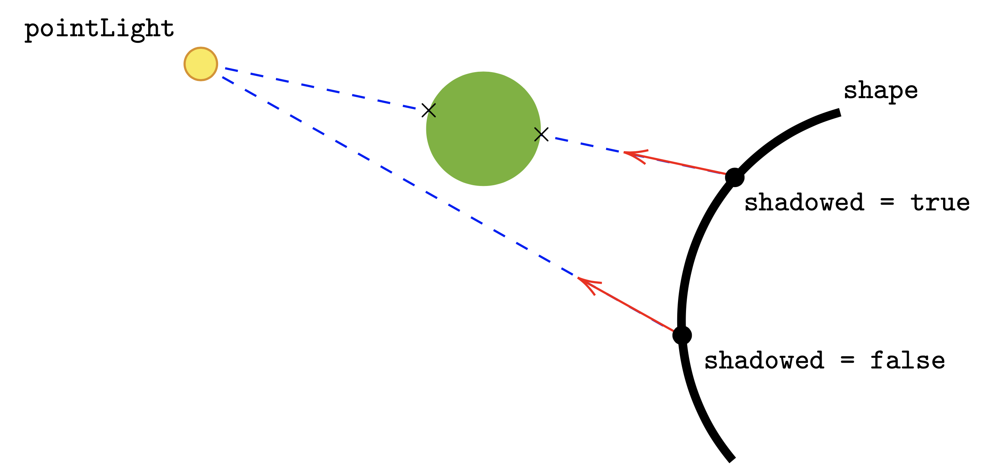 
### Live **WorldModule**
#### **WorldTopologyModule**

[.code-highlight: all]
```scala
object WorldTopologyModule {
  trait Service {
    def intersections(world: World, ray: Ray): 
      UIO[List[Intersection]]
    
    def isShadowed(world: World, pt: Pt): 
      UIO[Boolean]
  }  
}
```

---
^And implement the world module

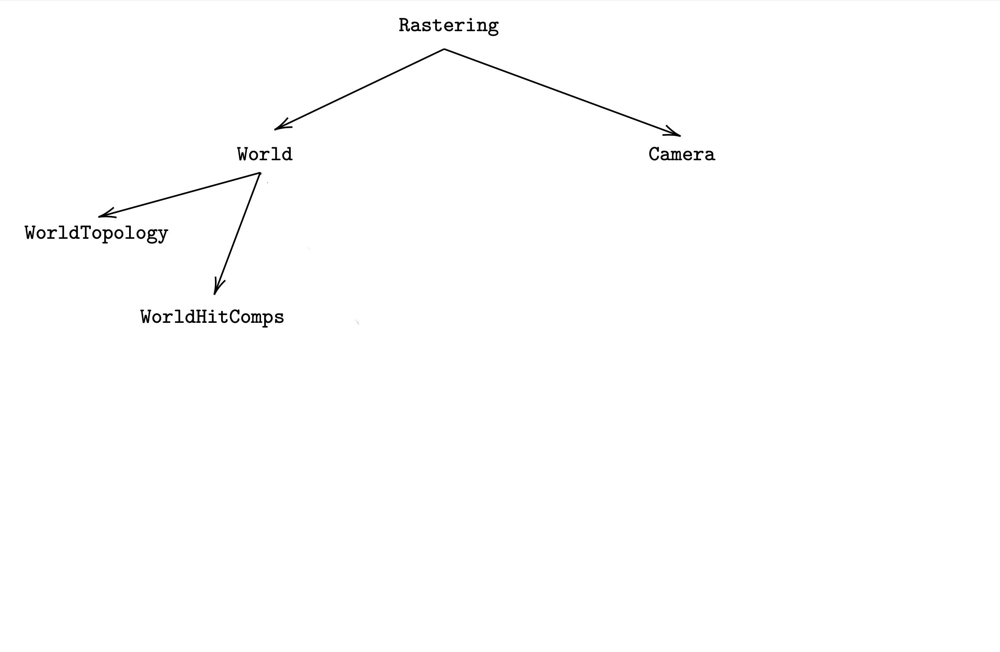 
### Live **WorldModule**
#### **WorldHitCompsModule**

[.code-highlight: none]
```scala
case class HitComps(
  shape: Shape, hitPt: Pt, normalV: Vec, eyeV: Vec, 
  rayReflectV: Vec, n1: Double = 1, n2: Double = 1
)

object WorldHitCompsModule {
  trait Service {
    def hitComps(
      ray: Ray, hit: Intersection, 
      intersections: List[Intersection]
    ): IO[GenericError, HitComps]
  }
}

```
---
^World hit components module

 
### Live **WorldModule**
#### **WorldHitCompsModule**

```scala
case class HitComps(
  shape: Shape, hitPt: Pt, normalV: Vec, eyeV: Vec, 
  rayReflectV: Vec, n1: Double = 1, n2: Double = 1
)

object WorldHitCompsModule {
  trait Service {
    def hitComps(
      ray: Ray, hit: Intersection, 
      intersections: List[Intersection]
    ): IO[GenericError, HitComps]
  }
}
```
---

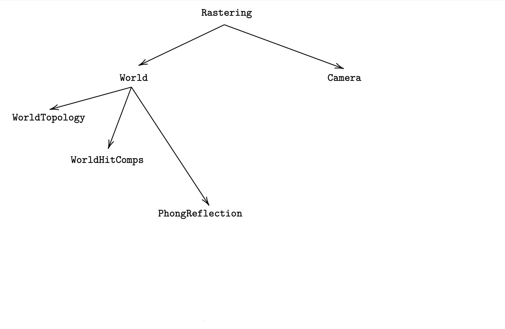 
### Live **WorldModule**
#### **PhongReflectionModule**

[.code-highlight: none]
```scala
case class PhongComponents(
  ambient: Color, diffuse: Color, reflective: Color
) {
  def toColor: Color = ambient + diffuse + reflective
}

object PhongReflectionModule {
  trait Service {
    def lighting(
      pointLight: PointLight, hitComps: HitComps, 
      inShadow: Boolean
    ): UIO[PhongComponents]
  }
}
```
---
^World hit components module

 
### Live **WorldModule**
#### **PhongReflectionModule**

[.code-highlight: all]
```scala
case class PhongComponents(
  ambient: Color, diffuse: Color, reflective: Color
) {
  def toColor: Color = ambient + diffuse + reflective
}

object PhongReflectionModule {
  trait Service {
    def lighting(
      pointLight: PointLight, hitComps: HitComps, 
      inShadow: Boolean
    ): UIO[PhongComponents]
  }
}
```


---
^So far we didn't look at the color of objects, or their material properties, but that's what makes the colors of an object. So we define a data type that collects the material properties that make how it looks like
*Ambient models the presence of an "ambient" light uniformly distributed in the world
*Diffusion models the behavior of light hitting a matte material and assumes that the effect of light hitting a material at a give point is just depending on the projection of the ray of light on the normal vector to the surface at that point. This will affect any eye observing that point in LOS.
*Specularity/shininess model how the source of light is reflected by the material, i.e. how you are going to see that lamp reflected on the object itself.


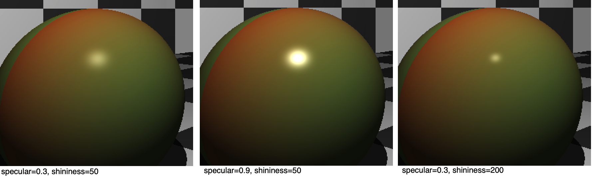 
### Reflect the ligtht source

Describe material properties

```scala
case class Material(
  color: Color, // the basic color
  ambient: Double,  // ∈ [0, 1] 
  diffuse: Double,  // ∈ [0, 1]
  specular: Double, // ∈ [0, 1]
  shininess: Double, // ∈ [10, 200]
)
```
---

 
### Live **PhongReflectionModule**
#### With **LightDiffusion** and **LightReflection** 


```scala
object PhongReflectionModule {
  trait Service { }

  val live: ZLayer[ATModule 
    with LightDiffusionModule 
    with LightReflectionModule, 
    Nothing, 
    PhongReflectionModule]
}
```

---
 
### Drawing program

```scala
def draw(sceneBundle: SceneBundle): 
  ZIO[CanvasSerializer 
    with RasteringModule 
    with ATModule,
    Nothing, 
    Array[Byte]]
```

---
 
### With Http4s

```scala
class DrawRoutes[R <: CanvasSerializer with RasteringModule with ATModule] {
  type F[A] = RIO[R, A]
  private val http4sDsl = new Http4sDsl[F] {}
  import http4sDsl._

  val httpRoutes: HttpRoutes[F] = HttpRoutes.of[F] {
    case req @ POST -> Root / "draw" =>
      req.decode[Scene] { scene =>
        (for {
          bundle    <- Http2World.httpScene2World(scene)
          bytes     <- draw(bundle)
        } yield bytes).foldM {
          e => InternalServerError(s"something went wrong"),
          Ok(bytes, "image/png")
        }
      }
  }
}
```

---
 
### And in main
##### Provide the layers

```scala
val world: ZLayer[ATModule, Nothing, WorldModule] = 
  (topologyM ++ hitCompsM ++ phongM) >>> worldModule.live  

val rastering: ZLayer[ATModule, Nothing, RasteringModule] = 
  (world ++ cameraModule.live) >>> rasteringModule.chunkRasteringModule

val full: ZLayer.NoDeps[Nothing, Rastering] = (layers.atM >>> rastering)

object Main extends zio.App {

  override def run(args: List[String]): ZIO[ZEnv, Nothing, Int] =
    httpProgram.provideLayer(full)
}
```
---

### Swapping modules

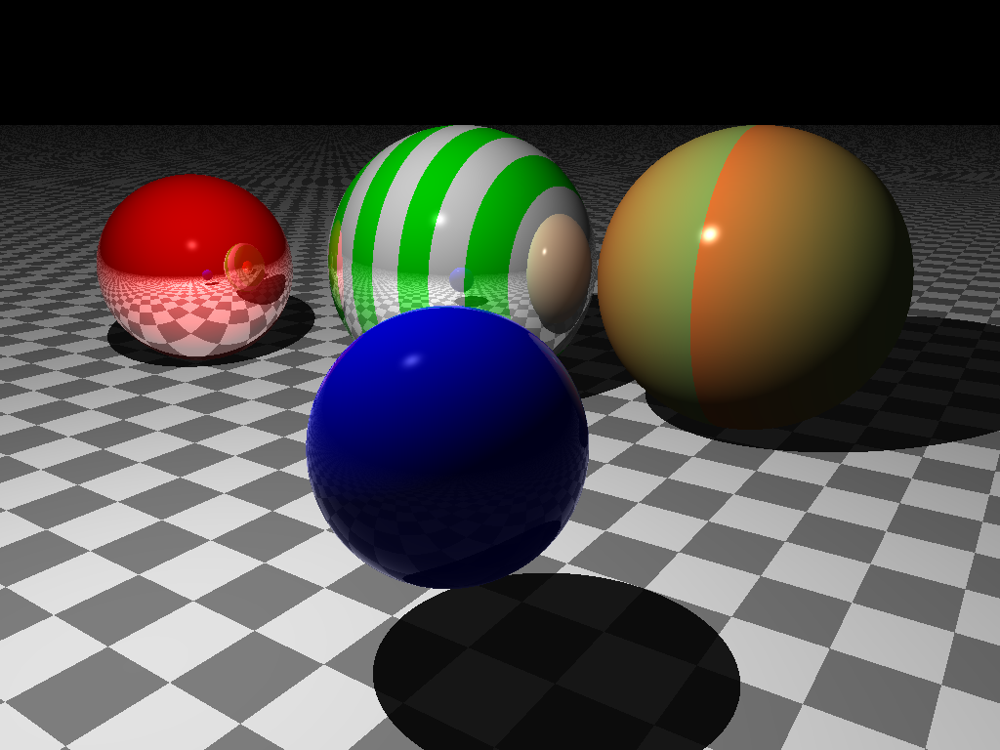 

[.build-lists: false]
- Red: reflective = 0.9
- Green/white: reflective = 0.6
- Blue: reflective = 0.9, transparency: 1

```scala
val world: ZLayer[ATModule, Nothing, WorldModule] = 
  (topologyM ++ hitCompsM ++ phongM) >>> worldModule.opaque
```
--- 
[.autoscale: false]

### Swapping modules

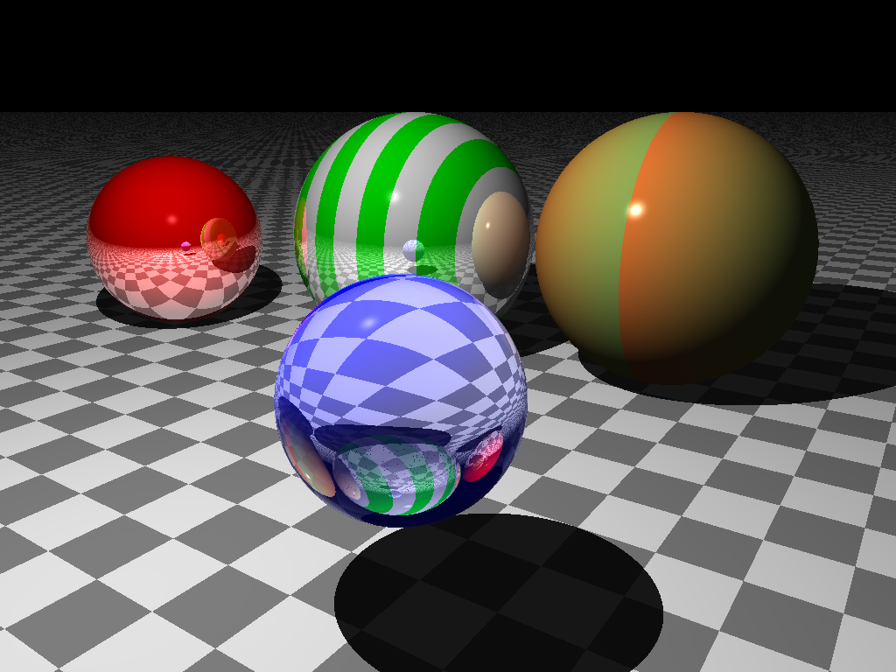 

[.build-lists: false]

- Red: reflective = 0.9
- Green/white: reflective = 0.6
- Blue: reflective = 0.9, transparency: 1


```scala
val world: ZLayer[ATModule, Nothing, WorldModule] = 
  (topologyM ++ hitCompsM ++ phongM) >>> worldModule.live
```
---

### Conclusion - **ZLayer**
[.text: alignment(left)]

- Deps graph in the code 💪
- Type safety, no magic 🙌
- Compiler helps to satisfy requirements 🤗
- Join ZIO Discord channel 😊

---

# Thank you!

 @pierangelocecc

 https://github.com/pierangeloc/ray-tracer-zio
