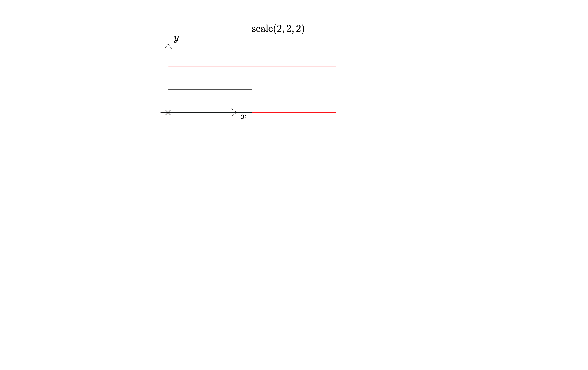
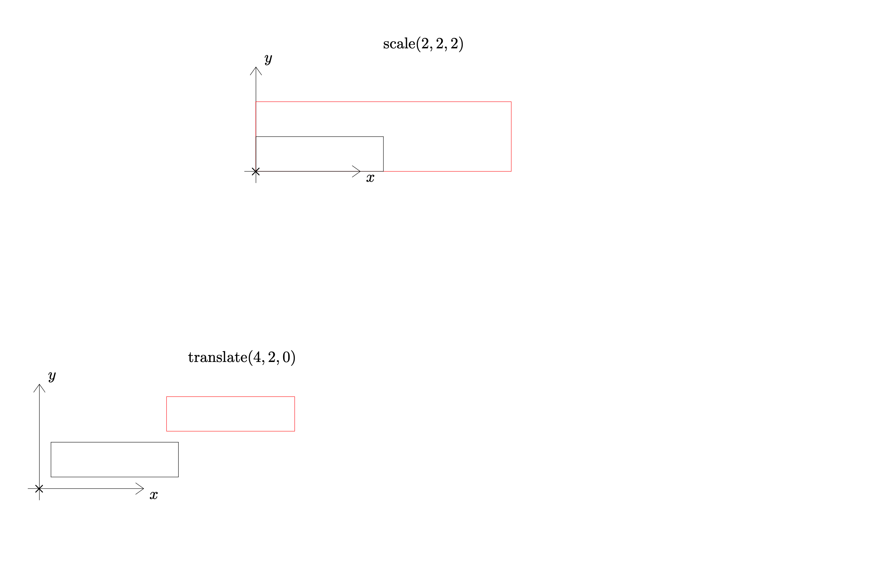
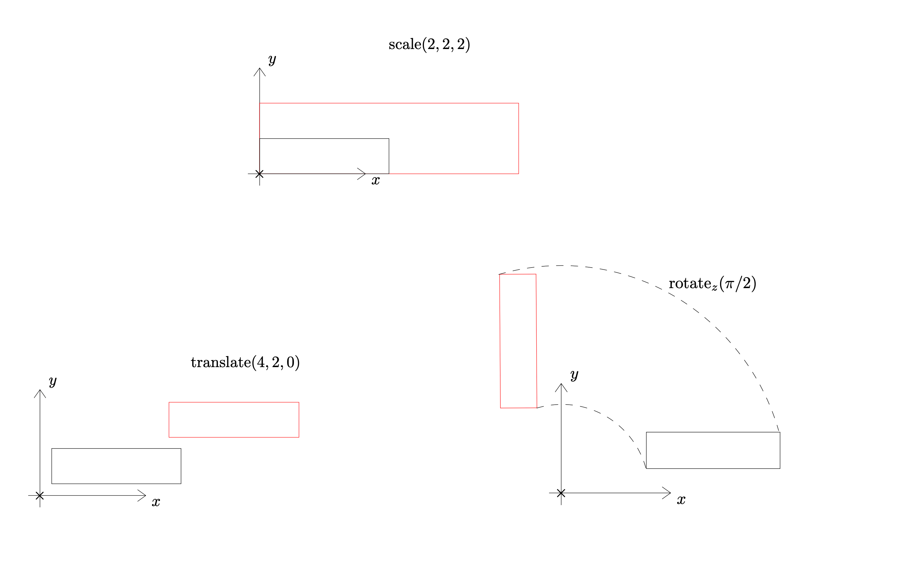

autoscale: true
slidenumbers: false
build-lists: true
image: background-color: #FF0000


# Environmental effects

# A ray tracing exercise

<br/>
<br/>
<br/>

 

---
# Agenda

1. Functional Effects
1. Environmental effects
1x. Module pattern (we can skip it and make it in the next point)
1. Build Ray tracer components
1. Test Ray tracer components
1. Wiring things together
1. Make it work :nut_and_bolt:
1. Make it fast :rocket:

---
# Functional Effects

<br>


<!--
# Functional Effects

^ Let's talk about functional effects. As functional programmers we appreciate the benefits of programming only with functions and immutable values 

FP: Programming with values and functions

---
[.autoscale: false]
# Functional Effects
^ for example let's consider a Matrix (value) and a function for adding 2 matrices. This function is defined for every possible pair of matrices, this means the function `add` is a TOTAL function

FP: Programming with values and functions


[.code-highlight: 1-4]
[.code-highlight: 1-6]
[.code-highlight: 1-9]

```scala
case class Matrix(
  x11: Double, x12: Double, 
  x21: Double, x22: Double
)

def add(m1: Matrix, m2: Matrix): Matrix = ???

add(Matrix(1, 2, 3, 4), Matrix(5, 6, 7, 8)) 
// Matrix(6, 8, 10, 12)
```

---
[.autoscale: false]

# Functional Effects
^ Now let's consider another function, that given a matrix, inverts it

FP: Programming with values and functions

[.code-highlight: 1]
[.code-highlight: 1-5]
[.code-highlight: 1-7]

```scala
def invert(m: Matrix): Matrix = ???
val m = Matrix( 
    1, 2, 
    1, 2
)

invert(m) // Exception!
```

---
[.autoscale: false]

# Functional Effects
^ `invert` is clearly not a total function

`invert` is not a total function

[.code-highlight: 1]
[.code-highlight: 1-6]
```scala
def invert(m: Matrix): Option[Matrix] = ???
invert(
  Matrix(
    1, 2,
    1, 2)
  ) // None
```

---
-->

---

^ What is a functional effect? It is a data structure, plus some operations, to deal with a concern.
E.g. if our concern is to express the presence or absence of a value, a functional effect we are using daily is `Option[A]`
If our concern is expressing the success (producing a value of type A) vs a failure (producing an error of type E) of an operation we can use `Either[E,A]` 

# Functional Effects

Given a concern, build _**an immutable data structure**_ that provides a set of operations to deal with that concern[^1]

[.code-highlight: none]
[.code-highlight: 1]
[.code-highlight: 1-2]
```scala
Option[A] 
Either[E, A]  
```

[^1]:  Semiquoting John De Goes (https://youtu.be/POUEz8XHMhE)

---

# Functional Effects
^ What do we do with these data structures? We can combine them (map, flatmap, zip), but ultimately we want to produce some workable value for our business case. Usually we us pattern matching, but we'd better get used to `fold`.
The interpretation phase takes these data structures, and extract the information and makes it usable

Interpretation: Produce some outcome from the processing of these data structures

[.code-highlight: none]
[.code-highlight: 1]
[.code-highlight: 1-2]
[.code-highlight: 1-4]
[.code-highlight: 1-5]
```scala
val oa: Option[A]    
val res: B = oa.fold[B](ifEmpty)(a => ifNonEmpty) 

val ea: Either[E, A] 
val res: B = ea.fold[B](e => ifError)(a => ifSuccess)
```

---

 

# Functional Effects
^ Let's talk about one of my favourite hobbies. Baking bread. How do I express the act of baking, in an imperative way? 
I just give a list of instructions and they get immediately executed
How do we deal with this in a functional way? We separate the description from the execution

#### Imperative baking

[.code-highlight: none]
[.code-highlight: 1]
[.code-highlight: 1-2]
[.code-highlight: 1-3]
[.code-highlight: 1-5]

```scala
def bakeBread(): Unit = {
  knead()
  raise()
  cook()
}
```
---

# Functional Effects
^ How do we deal with this in a functional way? We separate the description from the execution, having a data type that _describes_ what we want to do
Then we provide this data type with (pretty standard) mechanism to chain/transform the computation, classical `map`/`flatMap`

<!--   -->

#### Functional baking

[.code-highlight: none]
[.code-highlight: 1]
[.code-highlight: 1-2]
[.code-highlight: 1-3]
[.code-highlight: 1-9]
```scala
val knead: IO[Dough]
val raise(dough: Dough): IO[Dough]
val cook(dough: Dough): IO[Bread]

val bakeBread: IO[Bread] = for {
  d1 <- knead
  d2 <- raise(d1)
  b  <- cook(d2)
} yield b
```

---

# Functional Effects
^ ...and finally we get our bread by interpreting the data structure we just built.
It _traverses_ the data structure, or our recipe, and executes the instructions written on those data structures

<!--   -->

#### Functional baking

[.code-highlight: 1-2]
[.code-highlight: 1-5]
```scala
  def main() {
    val bakeBread: IO[Bread] = ???

    val bread: Bread = unsafeRun(bakeBread)   
  }


⠀
```

---
# Functional Effects
^ But how do I get by bread? I need to interpret the data structure

[.list: alignment(left)]
<!--   -->

#### Functional baking

```scala
  def main() {
    val bakeBread: IO[Bread] = ???

    val bread: Bread = unsafeRun(bakeBread)   
  }
```

1. Build an immutable data structure
1. Combine small data structures to more complex ones
1. Interpret the final data structure

<!-- 1. Enjoy your bread -->

<!-- ---
[.build-lists: false]

# Functional Effects
^ There are 2 concerns we didn't cover yet in this exercise. What if we put too much water in our dough? Can we recover from it? Should we retry somehow?

<!--   -->

<!-- ---

#### Functional baking
[.list: alignment(left)]

Errors -->

---
[.build-lists: false]

# Functional Effects
^ There are 2 concerns we didn't cover yet in this exercise. What if we cook too much our bread? What if our oven stops working halfway through? Well these are 2 different kinds of errors, one is what we call a failure (oven stops working), while the other one is what we call an error and we want to act upon (see talk from Francois Armand @ ScalaIO)

<!--   -->

#### Functional baking
[.list: alignment(left)]

Errors

[.code-highlight: none]
[.code-highlight: 1]
[.code-highlight: 1-4]
[.code-highlight: 1-7]
[.code-highlight: 1-10]

```scala
  sealed trait BakingError     extends Exception

  case object WrongIngredients extends BakingError
  case object Overcooking      extends BakingError

  val knead: IO[WrongIngredients, Dough] 
  val cook(dough: Dough): IO[Overcooking, Bread]
  
  val bake: IO[BakingError, Bread] =
    knead.flatMap(cook)  
```

---

<!-- [.build-lists: false]

# Functional Effects
^ There are 2 concerns we didn't cover yet in this exercise. What if we cook too much our bread? What if our oven stops working halfway through? Well these are 2 different kinds of errors, one is what we call a failure (oven stops working), while the other one is what we call an error and we want to act upon (see talk from Francois Armand @ ScalaIO)

#### Functional baking
[.list: alignment(left)]

1. Errors

```scala
  sealed trait BakingError     extends Exception

  case object WrongIngredients extends BakingError
  case object Overcooking      extends BakingError

  val knead: IO[WrongIngredients, Dough] 
  val cook(dough: Dough): IO[Overcooking, Bread]
```

---
[.build-lists: false]

# Functional Effects
^ There are 2 concerns we didn't cover yet in this exercise. What if we cook too much our bread? What if our oven stops working halfway through? Well these are 2 different kinds of errors, one is what we call a failure (oven stops working), while the other one is what we call an error and we want to act upon (see talk from Francois Armand @ ScalaIO)


#### Functional baking
[.list: alignment(left)]

Unaddressed concerns:

1. Errors

```scala
  sealed trait BakingError     extends Exception

  case object WrongIngredients extends BakingError
  case object Overcooking      extends BakingError
  
  val knead: IO[WrongIngredients, Dough] 
  val cook(dough: Dough): IO[Overcooking, Bread]
  
  val bake: IO[BakingError, Bread] =
    knead.flatMap(cook)  
```

--- -->

[.build-lists: false]

# Functional Effects
^ The second concern we need to deal with is the one of capabilities. What do I need in order to be able to knead my bread? What do I need to be able to cook it?
* ZIO[R, E, A] is an immutable data structure that expresses the concern of running a computation that might produce a value A, or fail with an error E, and requires a set of capabilities `R` in order to run
* So I define the methods in terms of the capabilities and then I chain them through the monadic operators. Notice that the contravariance in `R` is all the compiler need to do the `with` between environments

<!--   -->

#### Functional baking
[.list: alignment(left)]

Capabilities

[.code-highlight: none]
[.code-highlight: 1]
[.code-highlight: 1-5]
[.code-highlight: 1-7, 9-13]
[.code-highlight: 1-13]
```scala
  ZIO[-R, +E, +A] // R => IO[E, A]

  val knead:               ZIO[MixerEnv, WrongIngredients, Dough] = ???
  def raise(dough: Dough): ZIO[WarmRoomEnv, Nothing, Dough] = ???
  def cook(dough: Dough):  ZIO[OvenEnv, Overcooking, Bread] = ???

  val bread
    : ZIO[OvenEnv with WarmRoomEnv with MixerEnv, BakingError, Bread]
  = for {
    dough <- knead
    risen <- raise(dough)
    ready <- cook(risen)
  } yield ready
```

---
<!-- [.build-lists: false] -->

# Functional Effects
^ZIO effects must be interpreted, before that point they are just simple data structures. Default runtime environemnt can cope with effects that require standard JVM capabilities (console, random, system, clock and blocking), but if we have an effect that has richer requirements we must satisfy those requirements before running it.
So we provide our bread baking instructions with all the requirements they have, and finally we are able to interpret our data structure and get our bread.
The problem with this is that it's not immediate (not to me at least) how to make non-trivial applications, in a layered way, with dependencies of layer upon layer, or even with circular dependencies?

#### Provide and run

[.code-highlight: none]
[.code-highlight: 1]
[.code-highlight: 1-3]
[.code-highlight: 1-5]
```scala
  val bread: ZIO[OvenEnv with WarmRoomEnv with MixerEnv, BakingError, Bread] = ???

  val r: ZIO[Any, BakingError, Bread] = bread.provide(new OvenEnv with WarmRoomEnv with MixerEnv)
  
  val result:Bread = runtime.unsafeRun(bread)
```

- Nice, but how do we deal with non-trivial applications?

<!-- ---
[.build-lists: false]

# Environmental effects
^ What are environmental effects? They are functional effects (= immutable data structures) that model, at once, the requirement of an environment, the possibility to fail or succeed, and the possiblity to perform IO
This simple data type allows us to express different things: 
1. The introduction of an environment requirement. I can access the mixing machine together with the oven through that R


### `ZIO[-R, +E, +A]`

[.code-highlight: none]
[.code-highlight: 1-5]
[.code-highlight: 1-10]
```scala
  object ZIO {
    //environment introduction
    def access[R, E, A](f: R => A): ZIO[R, Nothing, A]
    def accessM[R, E, A](f: R => ZIO[R, E, A]): ZIO[R, E, A]
  }
```

---

# Environmental effects
^ What are environmental effects? They are functional effects (= immutable data structures) that model, at once, the requirement of an environment, the possibility to fail or succeed, and the possiblity to perform IO
This simple data type allows us to express different things: 
1. The introduction of an environment requirement. I can access the environemnt that provides me with the mixing capabilities


### `ZIO[-R, +E, +A]`

Environment introduction 

[.code-highlight: 1-5]
[.code-highlight: 1-9]
[.code-highlight: 1-13]
[.code-highlight: 1-18]
```scala
  object ZIO {
    def access[R, E, A](f: R => A): ZIO[R, Nothing, A]
    def accessM[R, E, A](f: R => ZIO[R, E, A]): ZIO[R, E, A]
  }

  trait MixingMachine {
    def knead: ZIO[Any, WrongIngredients, Dough] //IO[WrongIngredients, Dough]
  }

  trait MixerEnv {
    val mixingMachine: MixingMachine
  }

  val knead: ZIO[MixerEnv, WrongIngredients, Dough] =
    ZIO.accessM { mixerEnv =>
      mixerEnv.mixingMachine.knead
    }
```

---

# Environmental effects
^ And then, later (typically close to the main program, or in testing) I can provide the environment that my functional effect needs, eliminating the requirement of that environment 

### `ZIO[-R, +E, +A]`

Environment elimination

[.code-highlight: none]
[.code-highlight: 1-4]
[.code-highlight: 1-9]
```scala
  trait ZIO[-R, +E, +A] {
    // environment  elimination
    def provide(r: R): ZIO[Any, E, A]
  }

  val knead: ZIO[MixerEnv, WrongIngredients, Dough]
  
  val autonomousEffect = knead.provide(new MixerEnv{})
  val dough: Dough = runtime.unsafeRun(autonomousEffect)
```

---

# Environmental effects
^ How do we mix these capabilities and error together? The simplest thing we can do is just flatmap these structures 

 

#### Functional baking

Chaining errors and capabilities

```scala
  val knead:               ZIO[MixerEnv, WrongIngredients, Dough]
  val raise(dough: Dough): ZIO[WarmRoomEnv, Nothing, Dough]
  val cook(dough: Dough):  ZIO[OvenEnv, Overcooking, Bread]

  val bakeBread = for {
    d1 <- knead
    d2 <- raise(d1)
    b  <- cook(d2)
  } yield b 
```

---

# Environmental effects
^ Not only ths works, but the compiler infers errors and environment for us
We can see that the act of chaining these operations makes the required capabilities mix into an intersection type between
the capabilities (`type BakingEnv = MixerEnv with WarmRoomEnv with OvenEnv`), and it tries to unify the errors, looking for the nearest common supertype of errors, in our case `BakingError`


 

#### Functional baking

Chaining errors and capabilities

```scala
  val knead:               ZIO[MixerEnv, WrongIngredients, Dough]
  val raise(dough: Dough): ZIO[WarmRoomEnv, Nothing, Dough]
  val cook(dough: Dough):  ZIO[OvenEnv, Overcooking, Bread]

  type BakingEnv = MixerEnv with WarmRoomEnv with OvenEnv
  
  val bakeBread: ZIO[BakingEnv, BakingError, Bread] = for {
    d1 <- knead
    d2 <- raise(d1)
    b  <- cook(d2)
  } yield b 
```

Full inference of Environment and errors
 -->
---
 

# Ray tracing
^The problem we want to solve is rendering a scene by simulating how the light works when coming from a light source, or from an environment, and hits some objects in an environemnt (world)
and finally hits the sensors in a camera, or the photosensitive cells in our retina

[.list: alignment(left)]
- Spheres (world), light source, eye

---
 

[.build-lists: false]

# Ray tracing
[.list: alignment(left)]

- Spheres (world), light source, eye
- Incident rays    

---

^ but.. how do we build an image, ultimately?

 

[.build-lists: false]

# Ray tracing
[.list: alignment(left)]

- Spheres (world), light source, eye
- Incident rays    
- Reflected rays

---
^To build an image we need a canvas, a rectangular surface divided in pixels where the rays coming from the world will hit and produce the color they carry in the ray

 

[.build-lists: false]

# Ray tracing
[.list: alignment(left)]

- Spheres (world), light source, eye
- Incident rays    
- Reflected rays
- Canvas

---

 

[.build-lists: false]

# Ray tracing
[.list: alignment(left)]

- Spheres (world), light source, eye
- Incident rays    
- Reflected rays
- Canvas

---

 

[.build-lists: false]

# Ray tracing
[.list: alignment(left)]

- Spheres (world), light source, eye
- Incident rays    
- Reflected rays
- Canvas

---

 

[.build-lists: false]

# Ray tracing
[.list: alignment(left)]

- Spheres (world), light source, eye
- Incident rays    
- Reflected rays
- Canvas
- Discarded rays

---
^At this point we have 2 options, one is computing all the rays for all the objects, and then consider only those that hit the canvas
Another option is work on the reverse problem, i.e. have rays going out of the canvas, hitting the objects in the world and determine how they behave considering all the agents

 

# Ray tracing

Options:

[.list: alignment(left)]
1. Compute all the rays (and discard most of them)
1. Compute only the rays outgoing the canvas, and determine how they behave on the surfaces

---
^Let's start building our model. A ray is an infinite line with a starting point

 

# Ray tracing

A ray is defined by the point it starts from, and its direction

$$
P(t) = P_0 + t \vec{D},   t > 0 
$$

---
^Let's start building our model. A ray is an infinite line with a starting point

 

# Ray tracing

### Points and Vectors

[.code-highlight: 1-6]
[.code-highlight: 1-14]
```scala
case class Vec(x: Double, y: Double, z: Double) {
  def +(other: Vec): Vec   = 
    Vec(x + other.x, y + other.y, z + other.z)
  def unary_- : Vec = 
    Vec(-x, -y, -z)
}

case class Pt(x: Double, y: Double, z: Double) {
  def -(otherPt: Pt): Vec =
    Vec(x - otherPt.x, y - otherPt.y, z - otherPt.z)
  def +(vec: Vec)         = 
    Pt(x + vec.x, y + vec.y, z + vec.z)
}
```

---
^Let's start building our model. A ray is an infinite line with a starting point

 

### Points and Vectors

Properties

[.code-highlight: 1-7]
[.code-highlight: 1-14]
```scala
testM("vectors form a group")(
  check(vecGen, vecGen, vecGen) { (v1, v2, v3) =>
    assertApprox  (v1 + (v2 + v3), (v1 + v2) + v3) &&
    assertApprox (v1 + v2 , v2 + v1) &&
    assertApprox (v1 + Vec.zero , Vec.zero + v1)
  }
),


testM("vectors and points form an affine space") (
  check(ptGen, ptGen) { (p1, p2) =>
    assertApprox (p2, p1 + (p2 - p1))
  }
)
```

---
^Let's start building our model. A ray is an infinite line with a starting point

 

### Ray

$$
P(t) = P_0 + t \vec{D},   t > 0 
$$

[.code-highlight: none]
[.code-highlight: 1-3]
```scala
case class Ray(origin: Pt, direction: Vec) {
  def positionAt(t: Double): Pt = origin + (direction * t)
}
```

---
[.build-lists: false]

^Actually we want to do more interesting things than just adding points and vectors. We want to be able to scale, translate, rotate points and vectors

 

# Ray tracing

Move/scale: objects, view, light

### Affine Transformations
- Scale vectors and points

---
[.build-lists: false]

^Actually we want to do more interesting things than just adding points and vectors. We want to be able to scale, translate, rotate points and vectors

 

# Ray tracing

Move/scale: objects, view, light

### Affine Transformations
- Scale vectors and points
- Translate points (vectors don't translate)

---
[.build-lists: false]

^Actually we want to do more interesting things than just adding points and vectors. We want to be able to scale, translate, rotate points and vectors

 

# Ray tracing

Move/scale: objects, view, light

### Affine Transformations
- Scale vectors and points
- Translate points (vectors don't translate)
- Rotate vectors and points

---

[.build-lists: false]

^Actually we want to do more interesting things than just adding points and vectors. We want to be able to scale, translate, rotate points and vectors

 

# Ray tracing

Move/scale: objects, view, light

### Affine Transformations
- Scale vectors and points
- Translate points (vectors don't translate)
- Rotate vectors and points
- Chain transformations

---

^It turns out that all we need for this, is matrices 4x4 and matrix product, and a little convention

 

# Convention

- Vectors are column matrices with 0 as 4th element
`Vec(x, y, z)`  $$ \Rightarrow [x, y, z, 0]^T$$ 

- Points are column matrices with 1 as 4th element
`Pt(x, y, z)`  $$ \Rightarrow [x, y, z, 1]^T$$ 

---

^It turns out that all we need for this, is matrices 4x4 and matrix product

 

# Example: Rotation

- `rotate_z(pi/2, Vec(x, y, z))`

$$
\begin{pmatrix}
\cos \pi/2 & -\sin \pi/2 & 0 & 0\\
\sin \pi/2 & \cos \pi/2 & 0 & 0\\
0 & 0 & 1 & 0 \\
0 & 0 & 0 & 1 \\
\end{pmatrix}
\begin{pmatrix}
x\\
y\\
z \\
0\\
\end{pmatrix}
$$

- Same for all the other transformations

---

^It turns out that all we need for this, is matrices 4x4 and matrix product

 

# Composition

- Chaining 2 transformations equals multiplying the last one with the first one

- `translate` and then `rotate_z` 

- `rotate_z_matrix * translate_matrix`

---


---

^Enough of theory, let's build this. Let's start defining our matrix data type
The whole type is quite heavy to digest, so to forgive ourselves for the definition of such an abominion, we'll refer to matrix just as `M`
# Matrix Module

Matrix 

```scala
sealed abstract case class Matrix private (m: Int, n: Int, rows: Chunk[Chunk[Double]]) {
  def get(i: Int, j: Int): IO[IndexExceedMatrixDimension, Double] //ZIO[Any, ...]
  //... transpose etc
}

object Matrix {
 def fromRows(m: Int, n: Int, rows: L[L[Double]]): IO[MatrixConstructionError, Matrix[L]]
}

type M = Matrix
```

---

^Now let's define the operations we want to perform on matrices. These represent capabilities that are progressively required in our application,
so we model them through the module pattern. Module pattern provides a nice namespace separation between different capabilities that might be required
That namespace is in the `val` in the trait
# Matrix Module

Operations on matrix

[.code-highlight: 1,3]
[.code-highlight: 1, 3, 5-12]
[.code-highlight: 1-12]
```scala
trait MatrixModule {
  val matrixModule: MatrixModule.Service[Any]
}

object MatrixModule {
  trait Service[R] {
    def add(m1: M, m2: M): ZIO[R, AlgebraicError, M]
    def mul(m1: M, m2: M): ZIO[R, AlgebraicError, M]
    def invert(m: M): ZIO[R, AlgebraicError, M]
    //... a few others
  }
}
```

---


^We can define a live implementation of our module, that delegates to Breeze the matrix operations
# Matrix Module

Live implementation (backed by Breeze)

```scala
trait MatrixModule {
  val matrixModule: MatrixModule.Service[Any]
}

object MatrixModule {
  trait BreezeMatrixModule extends MatrixModule {
    import breeze.linalg._
    override val matrixModule: Service[Any] = new Service[Any] {
      def invert(m: M): ZIO[Any, AlgebraicError, M] = for {
         //... 
        bm            <- ZIO.effectTotal(DenseMatrix.create(nrRows, nrCols, arrayElems))
        breezeInverse <- ZIO.effect(inv(bm)).mapError(_ => AlgebraicError.MatrixNotInvertible)
        res           <- M.create(breezeInverse)
      } yield res  
    }
  }
}
```

---
# Matrix Module

Recap:

- We defined a module with the definition of the capabilities to operate on matrices
- We provided an implementation of that service backed by Breeze
- We can define as many implementations as we want
 
---
^ Now that we have capability of operating on matrices (of any size), next step is to work with our 4 x 4 matrices to implement our transformatiosn
So we define an affine transformation data type, that we require to travel along with its inverse, for efficiency reasons
And then we define the module for affine transformations
The convention that makes everything work smooth, is to name your service instance in the module just like the module, with first letter lower case 
# Affine transformations module

[.code-highlight: 1-3]
[.code-highlight: 1-3, 9-10]
[.code-highlight: 1-3, 9-12]
[.code-highlight: 1-3, 9-15]
[.code-highlight: 1-3, 9-19]
[.code-highlight: 1-3, 9-19, 23]
[.code-highlight: 1-3, 5-7, 9-19, 23]

```scala
case class AT(direct: M, inverse: M) {
  def inverted: AT = AT(inverse, direct)
}

trait ATModule {
  val aTModule: ATModule.Service[Any]
}

object ATModule {
  trait Service[R] {
    def applyTf(tf: AT, vec: Vec): ZIO[R, AlgebraicError, Vec]
    def applyTf(tf: AT, pt: Pt): ZIO[R, AlgebraicError, Pt]
    def compose(first: AT, second: AT): ZIO[R, AlgebraicError, AT]
    def invert(tf: AT): ZIO[R, AlgebraicError, AT]
    def transpose(tf: AT): ZIO[R, AlgebraicError, AT]

    def translate(x: Double, y: Double, z: Double): ZIO[R, Nothing, AT]
    def scale(x: Double, y: Double, z: Double): ZIO[R, Nothing, AT]
    def rotateX(θ: Double): ZIO[R, Nothing, AT]
    def rotateY(θ: Double): ZIO[R, Nothing, AT]
    def rotateZ(θ: Double): ZIO[R, Nothing, AT]
    def shear(xY: Double, xZ: Double, yX: Double, yZ: Double, zX: Double, zY: Double): ZIO[R, Nothing, AT]
    def id: ZIO[R, Nothing, AT]
  }
}
```
---
^ Now that we have capability of operating on matrices (of any size), next step is to work with our 4 x 4 matrices to implement our transformatiosn
So we define an affine transformation data type, that we require to travel along with its inverse, for efficiency reasons
And then we define the module for affine transformations
# Affine transformations module

- Live implementation

[.code-highlight: none]
[.code-highlight: 1-10]
[.code-highlight: 1-18]
```scala
  trait Live extends ATModule {
    val matrixModule: MatrixModule.Service[Any]

    val aTModule: ATModule.Service[Any] = new ATModule.Service[Any] {
      override def applyTf(tf: AT, vec: Vec): ZIO[Any, AlgebraicError, Vec] =
        for {
          col    <- toCol(vec)
          colRes <- matrixModule.mul(tf.direct, v) // case class AT(direct: M, inverse: M)
          res    <- colToVec(colRes)
        } yield res

      override def compose(first: AT, second: AT): ZIO[Any, AlgebraicError, AT] =
        for {
          direct  <- matrixModule.mul(second.direct, first.direct)
          inverse <- matrixModule.mul(first.inverse, second.inverse)
        } yield AT(direct, inverse)
    }
  }
```
- Dependency on `MatrixModule`

---

- capability accessor method
- unit tests
- functional testing
- functional mocking
- macros
- add layers to the onion

---

Plan for the talk
^ Top down approach. Start from the camera, raster, render on canvas
Continue with how to produce the ray for the pixel and the color for the ray
Delegate the color computation to the World module
Live world module can rely further on Phong, LightReflection, Refraction etc...

---
# Functional Effects
^ Now let's consider another function, that given a matrix, inverts it

FP: Programming with values and functions

```scala
def invert(m: Matrix): Matrix = ???

val m = Matrix( 
    1, 2, 
    1, 2
)

invert(m) // Exception!
```

This function is not total. How do we deal with that?
---


## Preparing slides for your class doesn’t have to be an endless chore.
## Here are a few Deckset features that will help you get the most out of your slides.

---

# Footers and Slide Numbers

Include persistent custom footers and/or running slide numbers by using directives:

```
footer: © Unsigned Integer UG, 2017
slidenumbers: true
```

Make sure the two directives start on the *first line* of your markdown file, and ensure there are *no empty lines* between the two.

---

# Footnotes

Manage your footnotes[^] directly where you need them. Alongside numbers, you can also use text references[^Sample Footnote].

Include footnotes by inserting`[^Your Footnote]` within the text. The accompanying reference can appear anywhere in the document:

`[^Your Footnote]: Full reference here`

[^2]: This is the first footnote reference

[^Sample Footnote]: This is the second footnote reference

---

# Footnotes

Footnote references need to be *unique in the markdown file*. This means, that you can also reference footnotes from any slide, no matter where they are defined.

When there are multiple references are listed, they must all be separated by blanks lines.

---


# Nested Lists

- You can create nested lists
    1. by indenting
    1. each item with
    1. 4 spaces
- It’s that simple

---

# Links

Create links to any external resource—like [a website](http://www.deckset.com)—by wrapping link text in square brackets, followed immediately by a set of regular parentheses containing the URL where you want the link to point:

`‘[a website](http://www.deckset.com)’`

Your links will be clickable in exported PDFs as well!

---

# Display formulas

Easily include mathematical formulas by enclosing TeX commands in `$$` delimiters. Deckset uses [MathJax](http://www.mathjax.org/) to translate TeX commands into beautiful vector graphics.

<a name="formulas"></a>

---

## Schrödinger equation

The simplest way to write the time-independent Schrödinger equation is $$H\psi = E\psi$$, however, with the Hamiltonian operator expanded it becomes:

$$
-\frac{\hbar^2}{2m} \frac{d^2 \psi}{dx^2} + V\psi = E\psi
$$

---

# Captioned Images and Videos


Easily create captions using [inline] images/videos with text underneath.

---

# Plus:

- PDF export for printed handouts
- Speaker notes and rehearsal mode
- Switch theme and ratio on the fly
- Animated GIFs for cheap wins and LOLs :-)
