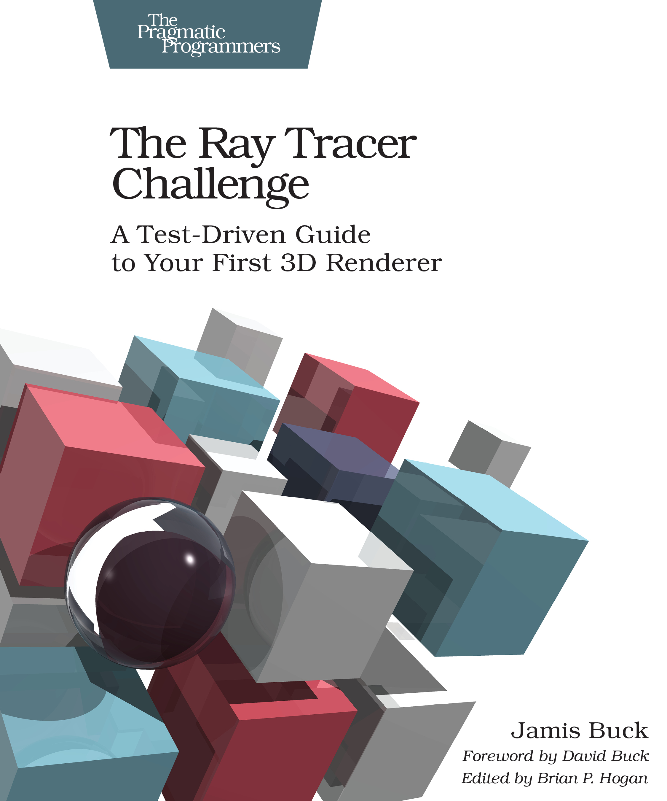
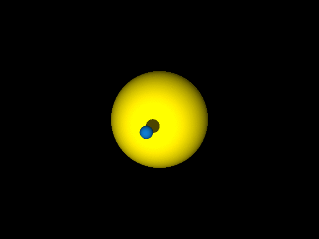
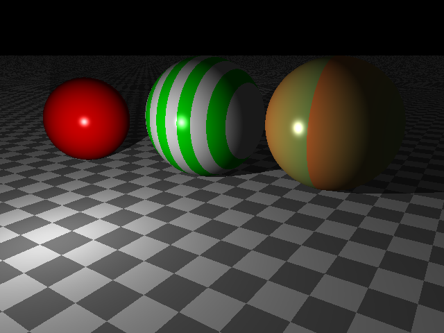

autoscale: true
slidenumbers: false
build-lists: true
list: alignment(left)
theme: Fira, 3

# Environmental effects


## A ray tracing exercise

<br/>
<br/>
<br/>

 

---
^A couple of words about myself
#### About me

### Pierangelo Cecchetto

### Scala Consultant - Amsterdam

[.text: alignment(left)]

 @pierangelocecc

 https://github.com/pierangeloc

---
^In this talk we'll talk about ZIO environment, and how to use it to described a layered set of computations where each type of computatoni is delegated to a specific component
* We'll see how to combine components and test their interactions in a purely functional way
* And all this will be an excuse to learn not only ZIO but how a ray tracer works 
* We will not cover all the fancy things zio offers such as concurrency, cancellation, fibers. They will be used behind the scenes but we don't discuss them here

 

[.text: alignment(left)]
### This talk
- **Will cover**
 - ZIO environment
 - Layered computations
 - Testing
 - How ray tracing works
 
- **Will not cover**
- Errors, Concurrency, fibers, cancellation, runtime

---
^The agenda for the talk:
* We'll cover the bare minimum knowledge of zio to understand the meaning of the environment
* Build quickly the foundations to manage rays
* Build the components to build a ray tracer
* Test these components
* Wire things together
* Make pictures nicer
# Agenda

1. ZIO-101: the bare minimum
1. Build foundations
1. Build Ray Tracer components
1. Test Ray tracer components
1. Wiring things together
1. Improving rendering
1. Show pattern at work


---
# ZIO - 101

^ZIO belongs together with other projects, to the set of Functional Effects libraries. This means that computations are just values instead of statements, that can be manipulated and combined, and then interpreted separetely
Let's write a simple program, and show how we can compose small programs into bigger programs. Notice that we are not building programs as "running things", we are building programs as data structures, and what I have after I have built these programs are just data structures, it's like having built a tree. The next step is to interpret the data structure, and that's the place where all impure stuff happens, where the console gets actually printed  
#### Program as values

[.code-highlight: 1]
[.code-highlight: 1-2]
[.code-highlight: 1-4]
[.code-highlight: 1-5]
[.code-highlight: 1-7]
[.code-highlight: 1-8]
[.code-highlight: 1-10]
```scala
val salutation = console.putStr("Zdravo, ")
val city = console.putStrLn("Ljubljana!!!")

val prg = salutation *> city
salutation.flatMap(_ => city)

// nothing happens!
runtime.unsafeRun(prg)

//>  Zdravo, Ljubljana!!!
```

---
# ZIO - 101

^If we look at our simple program, we see that the type has 3 parameters, the environment, the error channel and the output channel
ZIO is parameterized in 3 types, the environment, the error channel and the output channel. As a mental model, think of it as a ... which can be further simplified as ... One important thing is that it is contravariant in the environment, and covariant on the E,A 

[.code-highlight: 1]
[.code-highlight: 2-4]
[.code-highlight: 2-8] 
[.code-highlight: 2-12] 
```scala
val prg = salutation *> city
val prg: ZIO[Console, Nothing, Unit] = salutation *> city

ZIO[-R, +E, +A]

       ⬇

R => IO[Either[E, A]]

       ⬇

R => Either[E, A]
```

---
# ZIO - 101

^What does it mean when we see ZIO[Console, Nothing, Unit]?

```scala
val prg: ZIO[Console, Nothing, Unit] = salutation *> city
```

- Needs a `Console` to run
- Doesn't produce any error
- Produce `()` as output

---
# ZIO - 101

^In the first slide we cheated a bit. Our program could not be run. Actually a generic ZIO runtime is not able to run a program that requires console.
* The process to run an environmental effect is to satisfy all its requirements, and then execute it 
* The way you satisfy the requirements is `provide`
* now we eliminated the requirement, and this is witnessed in the type
* now I can run this "autonomous" effect in a runtime that provides nothing
* if I try to run an effect with unsatisfied requirement in an runtime that provides less than required I get an error

[.code-highlight: 1] 
[.code-highlight: 1-2] 
[.code-highlight: 1-5] 
[.code-highlight: 1-4, 6] 
[.code-highlight: 1-4, 6-8] 
[.code-highlight: 1-4, 6-9] 
[.code-highlight: 1-4, 6, 7, 10-13]
```scala
val prg: ZIO[Console, Nothing, Unit] = salutation *> city
val miniRT = new Runtime[Any]{}

// Provide console
val provided = prg.provide(Console.Live)
val provided: ZIO[Any, Nothing, Unit] = prg.provide(Console.Live)

miniRT.unsafeRun(provided)
//>  Zdravo, Ljubljana!!!

miniRT.unsafeRun(prg)
// [error]  found   : zio.ZIO[zio.console.Console,Nothing,Unit]
// [error]  required: zio.ZIO[Any,?,?]
```

---
^ In general ZIO provides mechanisms to introduce/eliminate environemnts
# ZIO - 101
### Environment introduction/elimination

[.code-highlight: 1] 
[.code-highlight: 1-4] 
[.code-highlight: 1-6] 
[.code-highlight: 1-8] 
```scala
// INTRODUCE AN ENVIRONMENT
ZIO.access(f: R => A): ZIO[R, Nothing, A]

ZIO.accessM(f: R => ZIO[R, E, A]): ZIO[R, E, A]

// ELIMINATE AN ENVIRONMENT
val prg: ZIO[Console, Nothing, Unit]
prg.provide(Console.Live): ZIO[Any, Nothing, Unit]
```
---
^ A couple of useful corner cases that allow us to exploit expressivenesss through types.
`IO[E,A]` is an effect that doesn't need anything but can fail or succeed
`UIO[A]` is an effect that doesn't need anything to run, and cannot fail (at least from the possible errors we want to cover)
In the latest ZIO RC there are even constraints that prevent to try to provide something to an effect that doesn't need anything, or trying to recover from errors on an effect that cannot fail

# ZIO - 101
### Types at work

```scala
type IO[+E, +A]   = ZIO[Any, E, A]

type UIO[+A]      = ZIO[Any, Nothing, A]
```


---
^The R part in ZIO makes it very convenient to use the module pattern. We use modules to model capabilities. All capabilities in ZIO are modelled as modules
* All we need is to adhere to a simple naming convention
* Let's define a module that allows us to handle metrics counter incrementations.
* Module
* Service
* Accessor
Notice that we just defined an interface, or if you want an algebra
# ZIO-101: Module Pattern

### Example: A Metrics module (or Algebra)

[.code-highlight: 1-4] 
[.code-highlight: 1-9] 
[.code-highlight: 1-16] 
```scala
// the module
trait Metrics {
  val metrics: Metrics.Service[Any]
}
object Metrics {
  // the service
  trait Service[R] {
    def inc(label: String): ZIO[R, Nothing, Unit]
  }

  // the accessor
  object > extends Service[Metrics] {
    override def inc(label: String): ZIO[Metrics, Nothing, Unit] =
      ZIO.accessM(_.metrics.inc(label))
  }
}
```

---
^Now we can write a program that uses our metrics module, and let's use it in conjunction with the console module
* SUPERB Type inference. Compiler is able to tell me that I need both these modules, I don't need to provide these capabilities beforehand like in TF
* Let's provide a live implementation that is backed by prometheus
* We can run it

# ZIO-101: Module Pattern
### A Metrics module - Running

[.code-highlight: 1, 3-8] 
[.code-highlight: 1-8] 
[.code-highlight: 1-15] 
[.code-highlight: 1-15, 18] 
[.code-highlight: 1-19] 
```scala
val prg2: 
ZIO[Metrics with Log, Nothing, Unit] = 
for {
  _ <- Log.>.info("Hello")
  _ <- Metrics.>.inc("salutation")
  _ <- Log.>.info("BeeScala")
  _ <- Metrics.>.inc("subject")
} yield ()

trait Prometheus extends Metrics {
  val metrics = new Metrics.Service[Any] {
    def inc(label: String): ZIO[Any, Nothing, Unit] = 
      ZIO.effectTotal(counter.labels(label).inc(1))
  }
}

miniRT.unsafeRun(
  prg2.provide(new Prometheus with Log.Live)
)
```

---
^Programs written in this style are completely testable. How do I unit test my program? I want to ensure that the counter gets called exactly once for "salutation" and once for "subject"
* The program remains the same value (data structure) we defined in first place 
* We define an implementation of the **SERVICE** backed by a data structure to handle state mutations
* We build an environment where the `Metrics` service is backed by this ref, and we provide it to our program, closing the requirements
* we run the test program, if this doesn't throw the test is green

# ZIO-101: Module Pattern
### A Metrics module - testing

[.code-highlight: none] 
[.code-highlight: 1] 
[.code-highlight: 1-7] 
[.code-highlight: 1-13] 
[.code-highlight: 1-14] 
[.code-highlight: 1-16] 
[.code-highlight: 1-18] 
```scala
val prg2: ZIO[Metrics with Log, Nothing, Unit] = /* ... */

case class TestMetrics(incCalls: Ref[List[String]]) 
  extends Metrics.Service[Any] {
  def inc(label: String): ZIO[Any, Nothing, Unit] =
    incCalls.update(xs => xs :+ label).unit
}

val test =  for {
  ref <- Ref.make(List[String]())
  _   <- prg2.provide(new Log.Live with Metrics {
           val metrics = TestMetrics(ref)
         })
  calls <- ref.get
  _     <- UIO.effectTotal(assert(calls == List("salutation", "subject")))
} yield ()

miniRt.unsafeRun(test)
```

---
# Ray tracing
#### Why?

  

[Presentation](https://www.slideshare.net/jdegoes/the-death-of-final-tagless)
[Book](https://pragprog.com/book/jbtracer/the-ray-tracer-challenge)

---
^In ray tracing we have 3 components: 
- The world (of spheres), and ambient light
- A Light source
- A Camera
- Reflected Rays
- Discarded rays
- Canvas 

 

# Ray tracing
[.list: alignment(left)]

- World (spheres), light source, camera
- Incident rays    
- Reflected rays

---
^To build an image we need a canvas, a rectangular surface divided in pixels where the rays coming from the world will hit and produce the color they carry in the ray

 

[.build-lists: false]

# Ray tracing
[.list: alignment(left)]

- World (spheres), light source, camera
- Incident rays    
- Reflected rays
- Discarded rays
- Canvas

---

 

[.build-lists: false]

# Ray tracing
[.list: alignment(left)]

- World (spheres), light source, camera
- Incident rays    
- Reflected rays
- Discarded rays
- Canvas
- Colored pixels

---

 

[.build-lists: false]

# Ray tracing
[.list: alignment(left)]

- World (spheres), light source, camera
- Incident rays    
- Reflected rays
- Discarded rays
- Canvas
- Colored pixels

---
^At this point we have 2 options, one is computing all the rays for all the objects, and then consider only those that hit the canvas
Another option is work on the reverse problem, i.e. have rays going out of the canvas, hitting the objects in the world and determine how they behave considering all the agents

 

# Ray tracing

Options:

[.list: alignment(left)]
1. Compute all the rays (and discard most of them)
1. Compute only the rays outgoing from the camera through the canvas, and determine how they behave on the surfaces

---
^Let's start building our model. A ray is an infinite line with a starting point. So let's start with the components we need to represent it, i.e. points and vectors

 

# Ray

A ray is defined by the point it starts from, and its direction

$$
P(t) = P_0 + t \vec{D},   t > 0 
$$

---

# Foundations
^ The foundations of this all are points and vectors, which are both represented by 3 numbers, but the difference is that vectors can be added with each othr, but points cannot. What you can do with points is add a vector to a point to get another point. And what you are building this way is an affine space

 

[.list: alignment(left)]
- Points and Vectors
- Transformations (rotate, scale, translate)

---
^ It's pretty easy to encode this in simple scala... and to verify that they satisfy the properties we just mentioned 

 


### Points and Vectors

[.code-highlight: 1-6]
[.code-highlight: 1-14]
```scala
case class Vec(x: Double, y: Double, z: Double) {
  def +(other: Vec): Vec   = 
    Vec(x + other.x, y + other.y, z + other.z)
  def unary_- : Vec = 
    Vec(-x, -y, -z)
}

case class Pt(x: Double, y: Double, z: Double) {
  def -(otherPt: Pt): Vec =
    Vec(x - otherPt.x, y - otherPt.y, z - otherPt.z)
  def +(vec: Vec)         = 
    Pt(x + vec.x, y + vec.y, z + vec.z)
}
```

---
^The first thing we do when we build our representation is to establish properties, so we write some PBT to check that 
* `(Vec, +)` form a group, 
* `(Vec, Pt, +, -)` form an affine space
* `approx` is due to double finite precision

 

### Points and Vectors

`zio-test` for PBT

[.code-highlight: 1-7]
[.code-highlight: 1-14]
```scala
testM("vectors form a group")(
  check(vecGen, vecGen, vecGen) { (v1, v2, v3) =>
    assertApprox  (v1 + (v2 + v3), (v1 + v2) + v3) &&
    assertApprox (v1 + v2 , v2 + v1) &&
    assertApprox (v1 + Vec.zero , Vec.zero + v1)
  }
),


testM("vectors and points form an affine space") (
  check(ptGen, ptGen) { (p1, p2) =>
    assertApprox (p2, p1 + (p2 - p1))
  }
)
```

---
^once we define points and vectors, the definition of a ray is immediate:

 

### Ray

$$
P(t) = P_0 + t \vec{D},   t > 0 
$$

```scala
case class Ray(origin: Pt, direction: Vec) {
  def positionAt(t: Double): Pt =
    origin + (direction * t)
}
```

---
^ Provided 
* we have an AT type for our affine transformation 
* let's define a ZIO module to operate on  transformations, so we start defining a Service to apply them to point, vectors, and chain/compose them
* Define a trait that has a val with the same name of the module, pointing to the service we just created
* Define an object extending the Service, parameterized on the module itself. 
* The accessor creation is pretty repetitive and mechanical, so an annotation can do the boring stuff for us (the same way simulacrum does for typeclasses)

### Transformations 

[.code-highlight: 1]
[.code-highlight: 1, 7, 9-14]
[.code-highlight: 1, 3-5, 7, 9-14]
[.code-highlight: 1, 3-5, 7, 9-14, 16-26]
[.code-highlight: 1-5, 7, 9-14, 16-26]
[.code-highlight: 1-14, 16-26]
[.code-highlight: 1-26]
```scala
trait AT
/* Module */
trait ATModule {
  val aTModule: ATModule.Service[Any]
}

object ATModule {
  /* Service */
  trait Service[R] {
    def applyTf(tf: AT, vec: Vec): ZIO[R, ATError, Vec]
    def applyTf(tf: AT, pt: Pt): ZIO[R, ATError, Pt]
    def compose(first: AT, second: AT): ZIO[R, ATError, AT]
  }

  /* Accessor */
  object > extends Service[ATModule] {
    def applyTf(tf: AT, vec: Vec): ZIO[ATModule, ATError, Vec] =
      ZIO.accessM(_.aTModule.applyTf(tf, vec))
    def applyTf(tf: AT, pt: Pt): ZIO[ATModule, ATError, Pt] =
      ZIO.accessM(_.aTModule.applyTf(tf, pt))
    def compose(first: AT, second: AT): ZIO[ATModule, ATError, AT] =
      ZIO.accessM(_.aTModule.compose(first, second))
  }
}
```

---
### Transformations

[.code-highlight: 1-26]
```scala
import zio.macros.annotation.accessible

trait AT
/* Module */
@accessible(">")
trait ATModule {
  val aTModule: ATModule.Service[Any]
}

object ATModule {
  /* Service */
  trait Service[R] {
    def applyTf(tf: AT, vec: Vec): ZIO[R, ATError, Vec]
    def applyTf(tf: AT, pt: Pt): ZIO[R, ATError, Pt]
    def compose(first: AT, second: AT): ZIO[R, ATError, AT]
  }

  /* Accessor is generated 
  object > extends Service[ATModule] {
    def applyTf(tf: AT, vec: Vec): ZIO[ATModule, ATError, Vec] =
      ZIO.accessM(_.aTModule.applyTf(tf, vec))
    def applyTf(tf: AT, pt: Pt): ZIO[ATModule, ATError, Pt] =
      ZIO.accessM(_.aTModule.applyTf(tf, pt))
    def compose(first: AT, second: AT): ZIO[ATModule, ATError, AT] =
      ZIO.accessM(_.aTModule.compose(first, second))
  }
  */
}
```

---
^ This accessor object allows us to summon our module wherever necessary
### Transformations

[.code-highlight: 1-26]
```scala
trait AT
/* Module */
@accessible(">")
trait ATModule {
  val aTModule: ATModule.Service[Any]
}

object ATModule {
  /* Service */
  trait Service[R] {
    def applyTf(tf: AT, vec: Vec): ZIO[R, ATError, Vec]
    def applyTf(tf: AT, pt: Pt): ZIO[R, ATError, Pt]
    def compose(first: AT, second: AT): ZIO[R, ATError, AT]
  }
}
```

---
^ This accessor object allows us to summon our module wherever necessary, and build something like this, where I'm summoning capabilities from different modules, not only, but the compiler is able to infer and mix these capabilities for us
### Transformations

[.code-highlight: 1-26]
```scala
val rotatedPt = 
  for {
    rotateX <- ATModule.>.rotateX(math.Pi / 2)
    _       <- Log.>.info("rotated of π/2")
    res     <- ATModule.>.applyTf(rotateX, Pt(1, 1, 1))
  } yield  res
```
---

^ Show type inference
### Transformations

[.code-highlight: 1-26]
```scala
val rotatedPt: ZIO[ATModule with Log, ATError, Pt] =
  for {
    rotateX <- ATModule.>.rotateX(math.Pi / 2)
    _       <- Log.>.info("rotated of π/2")
    res     <- ATModule.>.applyTf(rotateX, Pt(1, 1, 1))
  } yield  res
```

---

^ Now we want to provide an implementation of this module. With an easy convention to translate vectors and points into 4-tuples, all we need is matrix multiplication  
### Transformations - Live

```scala
val rotated: ZIO[ATModule, ATError, Vec] = 
  for {
    rotateX <- ATModule.>.rotateZ(math.Pi/2)
    res     <- ATModule.>.applyTf(rotateX, Vec(x, y, z))
  } yield res
```

[.list: alignment(left)]
- `Vec(x, y, z)`  $$ \Rightarrow [x, y, z, 0]^T$$ 

- `Pt(x, y, z)⠀`  $$ \Rightarrow [x, y, z, 1]^T$$ 

- ⠀
$$
\mathtt{rotated} = \begin{pmatrix}
\cos \pi/2 & -\sin \pi/2 & 0 & 0\\
\sin \pi/2 & \cos \pi/2 & 0 & 0\\
0 & 0 & 1 & 0 \\
0 & 0 & 0 & 1 \\
\end{pmatrix}
\begin{pmatrix}
x\\
y\\
z \\
0\\
\end{pmatrix}
$$

---

^ Given that we defined somewhere else another module to handle matrices
### Transformations - Live

[.code-highlight: 1-6]
[.code-highlight: 1-18]
```scala
// Defined somewhere else
object MatrixModule {
  trait Service[R] {
    def add(m1: M, m2: M): ZIO[R, AlgebraicError, M]
    def mul(m1: M, m2: M): ZIO[R, AlgebraicError, M]
  }
}

trait Live extends ATModule {
  val matrixModule: MatrixModule.Service[Any]

  val aTModule: ATModule.Service[Any] = new ATModule.Service[Any] {
    override def applyTf(tf: AT, vec: Vec): ZIO[Any, AlgebraicError, Vec] =
      for {
        col    <- PointVec.toCol(vec)
        colRes <- matrixModule.mul(tf, col)
        res    <- PointVec.colToVec(colRes)
      } yield res
```

---

^ Now that we have a live implementation of our AT, let's see if we can run our rotation (forgetting about the Log module for a moment)
### Transformations - running

[.code-highlight: 1]
[.code-highlight: 1-2]
[.code-highlight: 1-6]
```scala
val rotated: ZIO[ATModule, ATError, Vec]  = ...
val program = rotatedPt.provide(new ATModule.Live{})
// Compiler error:
// object creation impossible, since value matrixModule 
// in trait Live of t ype matrix.MatrixModule.Service[Any] is not defined
// [error]   rotatedPt.provide(new ATModule.Live{})
```
---

^ If I provide the ATModule with the missing dependency, i.e. an implementation of the MatrixModule
### Transformations - running

[.code-highlight: 1]
[.code-highlight: 1-5]
[.code-highlight: 1-7]
```scala
val rotated: ZIO[ATModule, ATError, Vec]  = ...
val program = rotatedPt.provide(
  new ATModule.Live with MatrixModule.BreezeLive
) 
// Compiles!
runtime.unsafeRun(program)
// Runs!
```
---
^So now we have a tool that allows us to perform the std transformations on our points and vectors, so we are ready to build a camera

### Layer 1: Transformations


---
^The first thing to consider is that everything is relative. If my standard position as observer is x=0, and I want to see how things look like from x = -3, what I can do is translate the world of +3 and keep on sitting at x = 0. We call this the canonical position
### Camera 

##### Everything is relative!

 

- Canonical camera: observe always from `x = 0` and translate the world by `+3`

---
^In the same spirit, let's define our canonical camera

 

### Camera - canonical

[.code-highlight: 1-4, 6]
```scala
case class Camera (
  hRes: Int,
  vRes: Int,
  fieldOfViewRad: Double,
  tf: AT
)
```

---

### Camera - generic
^Following the same reasoning we did with our camera translated in x=-3, we can generalize and build a generic camera by composing 2 transformations, one coping for the rotations, and one for the translations that brought our camera there. We have just to use the inverse because we will apply them to the world

 

[.code-highlight: 1]
[.code-highlight: 1, 10-16]
[.code-highlight: 1-16]
[.code-highlight: 1-20]
```scala
object Camera {

  def worldTransformation(from: Pt, to: Pt, up: Vec):
    ZIO[ATModule, Nothing, AT] = for {
    orientationAT <- // some prepration ...
    translateTf   <- ATModule.>.translate(-from.x, -from.y, -from.z)
    composed      <- ATModule.>.compose(translateTf,  orientationAT)
  } yield composed

  def make(
    viewFrom: Pt, 
    viewTo: Pt, 
    upDirection: Vec, 
    visualAngleRad: Double, 
    hRes: Int, 
    vRes: Int): 
    ZIO[ATModule, AlgebraicError, Camera] =
    worldTransformation(viewFrom, viewTo, upDirection).map { 
      worldTf => Camera(hRes, vRes, visualAngleRad, worlfTf)
    }
```

---

^For shapes we follow the same approach we followed for camera, canonical + transformation

### World
- `Sphere.canonical` $$ \{(x, y, z) : x^2 + y^2 + z^2 = 1\} $$
- `Plane.canonical` $$\{(x, y, z) : y = 0\} $$

[.code-highlight: none]
[.code-highlight: 1-4]
[.code-highlight: 1-6]
[.code-highlight: 1-7]
```scala
sealed trait Shape {
  def transformation: AT
  def material: Material
}

case class Sphere(transformation: AT, material: Material) extends Shape
case class Plane(transformation: AT, material: Material) extends Shape
```
---
^Let's see how we can make a generic sphere, a generic plane, and put them in the world

### World

##### Make a world

[.code-highlight: none]
[.code-highlight: 1-7]
[.code-highlight: 1-11]
[.code-highlight: 1-13]
```scala
object Sphere {
  def make(center: Pt, radius: Double, mat: Material): ZIO[ATModule, ATError, Sphere] = for {
    scale     <- ATModule.>.scale(radius, radius, radius)
    translate <- ATModule.>.translate(center.x, center.y, center.z)
    composed  <- ATModule.>.compose(scale, translate)
  } yield Sphere(composed, mat)
}

object Plane {
  def make(...): ZIO[ATModule, ATError, Plane] = ???
}

case class World(pointLight: PointLight, objects: List[Shape])
```

- Everything requires `ATModule`

---
^Rendering a world means producing an image that reprsents how the world looks like from our camera. So from the highest level I want to be able to produce a stream of colored pixels representing my image. So we define the module, make it accessible, and provide a trivial implementation that produces white pixels no matter what

### World Rendering - Top Down
#### Rastering - Generate a stream of colored pixels

[.code-highlight: 1-4]
[.code-highlight: 1-9]
[.code-highlight: 1-18]
```scala
@accessible(">")
trait RasteringModule {
  val rasteringModule: RasteringModule.Service[Any]
}
object RasteringModule {
  trait Service[R] {
    def raster(world: World, camera: Camera): 
      ZIO[R, Nothing, ZStream[R, RayTracerError, ColoredPixel]]
  }

  trait AllWhiteTestRasteringModule extends RasteringModule {
    val rasteringModule: Service[Any] = new Service[Any] {
      def raster(world: World, camera: Camera): UIO[ZStream[Any, RayTracerError, ColoredPixel]] =
        UIO.succeed(for {
          x <- ZStream.fromIterable(0 until camera.hRes)
          y <- ZStream.fromIterable(0 until camera.vRes)
        } yield ColoredPixel(Pixel(x, y), Color.white))
    }
  }
```

---
^Now what do we need to provide a LIVE implementation of this? We need to be able to provide one ray for each pixel of the camera, and for each ray we need to compute the color. Let's introduce 2 modules with these responsibilities

### World Rendering - Top Down
#### Rastering - Live

- Camera module - Ray per pixel

[.code-highlight: none]
[.code-highlight: 1-5]
```scala
object CameraModule {
  trait Service[R] {
    def rayForPixel(camera: Camera, px: Int, py: Int): ZIO[R, Nothing, Ray]
  }
}
```

- World module - Color per ray

[.code-highlight: none]
[.code-highlight: 1-5]
```scala
object WorldModule {
  trait Service[R] {
    def colorForRay(world: World, ray: Ray): ZIO[R, RayTracerError, Color]
  }
}
```

---
^And with these 2 modules we can provide a live implementation of the rastering logic. We declare dependencies on the *services* of our modules, and then we access them in the implmentation

### World Rendering - Top Down
#### Rastering - Live

[.code-highlight: 1-3]
[.code-highlight: 1-6, 11-14]
[.code-highlight: 1-20]
```scala
trait LiveRasteringModule extends RasteringModule {
  val cameraModule: CameraModule.Service[Any]
  val worldModule: WorldModule.Service[Any]

  override val rasteringModule: Service[Any] = new Service[Any] {
    override def raster(world: World, camera: Camera): UIO[ZStream[Any, RayTracerError, ColoredPixel]] = {
      val pixels: Stream[Nothing, (Int, Int)] = ???
      UIO(
        pixels.mapM{
          case (px, py) =>
            for {
              ray   <- cameraModule.rayForPixel(camera, px, py)
              color <- worldModule.colorForRay(world, ray)
            } yield data.ColoredPixel(Pixel(px, py), color)
        }
      )
    }
  }
}
```

---
^To unit test this we should mock the dependencies. ZIO-TEST provides a very convenient way to do the `Ref` trick we've seen before to an arbitrary complex scale, and it all boils down to 4 steps

[.build-lists: false]

### Test **LiveRasteringModule**
1 - Define the method under test

```scala
val world = /* prepare a world */
val camera = /* prepare a camera */

val appUnderTest: ZIO[RasteringModule, RayTracerError, List[ColoredPixel]] =
  RasteringModule.>.raster(world, camera)
    .flatMap(_.runCollect)
```

---
^The second step is make our dependencies mockable, just annotate them

[.build-lists: false]

### Test **LiveRasteringModule** 
2 - Annotate the modules as mockable

```scala
import zio.macros.annotation.mockable

@mockable
trait CameraModule { ... }

@mockable
trait WorldModule { ... }
```

---
^Step nr 3: define your expectations. We expect rayForPixel, when called for pixel 0, 0 to return ray r1
And we expect `colorForRay` when called for ray r1, to return red

[.build-lists: false]

### Test `LiveRasteringModule` 
3 - Build the expectations

```scala
val rayForPixelExp: Expectation[CameraModule, Nothing, Ray] =
  (CameraModule.rayForPixel(equalTo((camera, 0, 0))) returns value(r1)) *>
  (CameraModule.rayForPixel(equalTo((camera, 0, 1))) returns value(r2))

val colorForRayExp: Expectation[WorldModule, Nothing, Color] = 
  (WorldModule.colorForRay(equalTo((world, r1, 5))) returns value(Color.red)) *>
  (WorldModule.colorForRay(equalTo((world, r2, 5))) returns value(Color.green))
```

---
^Let's go back to the code we wanted to test. We must take all the expectations, flatmap/zip them and build a managed environment for our environmental effect under test. We turn the expectations into managed environments, which are similar to the environments but they have also strong guarantees of executing a release step, no matter what. Think of them as a try with resources on steroids, that works on asynchronous code as well. We'll see shortly why we have to make these expectations `Managed`

### Test **LiveRasteringModule** 
4 - Build the environment for the code under test

[.code-highlight: 1-3]
[.code-highlight: 1-20]
```scala
val appUnderTest: ZIO[RasteringModule, RayTracerError, List[ColoredPixel]] =
  RasteringModule.>.raster(world, camera)
    .flatMap(_.runCollect)

appUnderTest.provideManaged(
  worldModuleExp.managedEnv.zipWith(cameraModuleExp.managedEnv) { (wm, cm) =>
    new LiveRasteringModule {
      override val cameraModule: CameraModule.Service[Any] = cm.cameraModule
      override val worldModule: WorldModule.Service[Any] = wm.worldModule
        }
      }
    )
```

---
^And then we can assert

### Test **LiveRasteringModule**
5 - Assert on the results

```scala
assert(res, equalTo(List(
  ColoredPixel(Pixel(0, 0), Color.red),
  ColoredPixel(Pixel(0, 1), Color.green),
  ColoredPixel(Pixel(1, 0), Color.blue),
  ColoredPixel(Pixel(1, 1), Color.white),
  ))
)
```

---
^Here's how the whole test looks like. Why do we build managed? Managed has an acquire/release process, in the acquire we load the mocks, in the release we verify them, and we fail if this verification is unsatisfied.

### Test **LiveRasteringModule**

```scala
suite("LiveRasteringModule") {
  testM("raster should rely on cameraModule and world module") {
    val camera = Camera.makeUnsafe(Pt.origin, Pt(0, 0, -1), Vec.uy, math.Pi / 3, 2, 2)
    val world = World(PointLight(Pt(5, 5, 5), Color.white), List())
    val appUnderTest: ZIO[RasteringModule, RayTracerError, List[ColoredPixel]] =
      RasteringModule.>.raster(world, camera).flatMap(_.runCollect)

    for {
      (worldModuleExp, cameraModuleExp) <- RasteringModuleMocks.mockExpectations(world, camera)
      res <- appUnderTest.provideManaged(
        worldModuleExp.managedEnv.zipWith(cameraModuleExp.managedEnv) { (wm, cm) =>
          new LiveRasteringModule {
            override val cameraModule: CameraModule.Service[Any] = cm.cameraModule
            override val worldModule: WorldModule.Service[Any] = wm.worldModule
              }
            }
          )
      } yield assert(res, equalTo(List(
          ColoredPixel(Pixel(0, 0), Color.red),
          ColoredPixel(Pixel(0, 1), Color.green)
          )))
  }
}
```

---
^So the takeaway of this is...

### Test

#### Takeaway: Implement and test every layer only in terms of the immediately underlying layer

---
^And now that we got warmed up with this, let's go on and implement all the logic through modules

## Modules all the way down
#### Implement `CameraModule` and `WorldModule` 

---
^Here's a live implementation for the camera module, which is just considering that the camera is canonical, so we need to compute the real ray corresponding to a given pixel of th canonical camera

### Live **CameraModule**
```scala
trait Live extends CameraModule {
  val aTModule: ATModule.Service[Any]

  val cameraModule: CameraModule.Service[Any] = new Service[Any] {
    
    override def rayForPixel(camera: Camera, px: Int, py: Int): ZIO[Any, Nothing, Ray] =
      for {
        xOffset   <- UIO((px + 0.5) * camera.pixelXSize)
        yOffset   <- UIO((py + 0.5) * camera.pixelYSize)
        //coordinates of the canvas point before the transformation
        origX     <- UIO(camera.halfWidth - xOffset)
        origY     <- UIO(camera.halfHeight - yOffset)
        //transform the coordinates by the inverse
        inverseTf <- aTModule.invert(camera.tf)
        pixel     <- aTModule.applyTf(inverseTf, Pt(origX, origY, -1))
        origin    <- aTModule.applyTf(inverseTf, Pt.origin)
        direction <- (pixel - origin).normalized.orDie
      } yield Ray(origin, direction)
  }
```

---
^To provide a color for a ray, first thing to do is to see if that ray hits something. This responsibility is delegated to another module, responsible to deal with the topological structure of our world. 
* Let's define an intersection for a ray that hits a given shape

### Live **WorldModule**
[.code-highlight: 1]
[.code-highlight: 1-9]
[.code-highlight: 1-10]
[.code-highlight: 1-12]
[.code-highlight: 1-15]
```scala
case class Intersection(t: Double, sceneObject: Shape) 

trait Live extends WorldModule {
  val worldTopologyModule: WorldTopologyModule.Service[Any]

  override val worldModule: Service[Any] = new Service[Any] {
    def colorForRay(world: World, ray: Ray, remaining: Int = 5): ZIO[Any, RayTracerError, Color] =
      for {
        intersections <- worldTopologyModule.intersections(world, ray)
        maybeHitComps <- intersections.find(_.t > 0).traverse(i => hitComps(i))
        color <- maybeHitComps.fold[IO[RayTracerError, Color]](UIO(Color.black)) { hc =>
          worldTopologyModule.isShadowed(world, hc.overPoint).flatMap(process(hc, _))
        }
        /* ... */
      } yield color
```

---
^Let's look directly at the Live implementation of the `WorldTopologyModule`
* For the intersections, we need to traverse all the objects of the world, and look for the intersection between that object and the ray. This is delegated to the ray module that deals with all the possible shapes we want to handle (atm planes and spheres, but we can add cylinders, triangles, etc). I think you got the mechanism by now
* Topology is also about finding if a point is shadowed by another shape, and for this we take the vector that goes from the point intersected by the ray, pointing towards the light source, and see if that ray has intersections. If it has, the point is in shadow, otherwise it is clear.

### Live **WorldModule**
#### `WorldTopologyModule`
 

[.code-highlight: 6-7]
[.code-highlight: 1-7]
[.code-highlight: 1-11]
[.code-highlight: 1-18]
```scala
trait Live extends WorldTopologyModule {
  val rayModule: RayModule.Service[Any]

  override val worldTopologyModule: Service[Any] = new Service[Any] {

    def intersections(world: World, ray: Ray): 
      ZIO[Any, Nothing, List[Intersection]] =
      ZIO.traverse(world.objects)(rayModule.intersect(ray, _))
        .map(_.flatten.sortBy(_.t))

    def isShadowed(world: World, pt: Pt): ZIO[Any, Nothing, Boolean] =
      for {
        v        <- UIO(world.pointLight.position - pt)
        distance <- v.norm
        vNorm    <- v.normalized.orDie
        xs       <- intersections(world, Ray(pt, vNorm))
        hit      <- rayModule.hit(xs)
      } yield hit.exists(i => i.t > 0 && i.t < distance)
  }
} 
```
---
^ If we go back to our world module, the next thing to do is finding the hit components.
This calculation will be delegated to a module just responsible for that
### Live **WorldModule**
```scala
case class Intersection(t: Double, sceneObject: Shape) 

trait Live extends WorldModule {
  val worldTopologyModule: WorldTopologyModule.Service[Any]

  override val worldModule: Service[Any] = new Service[Any] {
    def colorForRay(world: World, ray: Ray, remaining: Int = 5): ZIO[Any, RayTracerError, Color] =
      for {
        intersections <- worldTopologyModule.intersections(world, ray)
        maybeHitComps <- intersections.find(_.t > 0).traverse(i => hitComps(i))
        color <- maybeHitComps.fold[IO[RayTracerError, Color]](UIO(Color.black)) { hc =>
          worldTopologyModule.isShadowed(world, hc.overPoint).flatMap(process(hc, _))
        }
        /* ... */
      } yield color


```

---
^ If we go back to our world module, the next thing to do is finding the hit components.
This calculation will be delegated to a module just responsible for that
### Live **WorldModule**
```scala
case class Intersection(t: Double, sceneObject: Shape) 

trait Live extends WorldModule {
  val worldTopologyModule: WorldTopologyModule.Service[Any]
  val worldHitCompsModule: WorldHitCompsModule.Service[Any]

  override val worldModule: Service[Any] = new Service[Any] {
    def colorForRay(world: World, ray: Ray, remaining: Int = 5): ZIO[Any, RayTracerError, Color] =
      for {
        intersections <- worldTopologyModule.intersections(world, ray)
        maybeHitComps <- intersections.find(_.t > 0).traverse(i => worldHitCompsModule.hitComps(i))
        color <- maybeHitComps.fold[IO[RayTracerError, Color]](UIO(Color.black)) { hc =>
          worldTopologyModule.isShadowed(world, hc.overPoint).flatMap(process(hc, _))
        }
        /* ... */
      } yield color
```


---
^ The `HitComponentsModule` will deal with this problem: given a ray that hits a surface, what is the angle between the ray and the normal to the surface in that point>? how is the ray reflected?
All these answers are covered by our hitComps module
### Live `WorldModule`
#### `HitCompsModule`

 

```scala
case class HitComps(
  shape: Shape, hitPt: Pt, normalV: Vec, eyeV: Vec, rayReflectV: Vec
)

trait Live extends WorldHitCompsModule {
  val normalReflectModule: NormalReflectModule.Service[Any]

  val worldHitCompsModule: WorldHitCompsModule.Service[Any] =
    new Service[Any] {
    def hitComps(
      ray: Ray, hit: Intersection, intersections: List[Intersection]
    ): ZIO[Any, GenericError, HitComps] =
    for {
      pt       <- UIO(ray.positionAt(hit.t))
      normalV  <- normalReflectModule.normal(pt, hit.sceneObject)
      eyeV     <- UIO(-ray.direction)
      reflectV <- normalReflectModule.reflect(ray.direction, normalV)
    } yield HitComps(hit.sceneObject, pt, normalV, eyeV, reflectV)
  }
}
```


---
### Determine the color

```scala

trait Live extends WorldModule {
  val worldTopologyModule: WorldTopologyModule.Service[Any]
  val worldHitCompsModule: WorldHitCompsModule.Service[Any]

  override val worldModule: Service[Any] = new Service[Any] {
    def colorForRay(world: World, ray: Ray, remaining: Int = 5): ZIO[Any, RayTracerError, Color] =
      for {
        intersections <- worldTopologyModule.intersections(world, ray)
        maybeHitComps <- intersections.find(_.t > 0).traverse(i => worldHitCompsModule.hitComps(i))
        color <- maybeHitComps.fold[IO[RayTracerError, Color]](UIO(Color.black)) { hc =>
          worldTopologyModule.isShadowed(world, hc.overPoint).flatMap(process(hc, _))
        }
        /* ... */
      } yield color

```

---
^ So going back to our WorldModule how does this process method is implemented?
* then we get the hit components. If no hit, display black
* If hit, calculate the hit components (those 4 vectors we saw before), determine if the point is shadowed, and then deterine the color. To determine the color, let's introduce another module that, from the hit components, can determine the color to be displayed for our ray. 
Usual procedure: Add the dependency, use it, provide an implementation. We use for this the Phong reflection model
### Determine the color
#### `PhongReflectionModule`


[.code-highlight: 1-10]
[.code-highlight: 1-12]
[.code-highlight: 1-13]
[.code-highlight: 1-24]
```scala
trait Live extends WorldModule {
    val worldTopologyModule: WorldTopologyModule.Service[Any]
    val worldHitCompsModule: WorldHitCompsModule.Service[Any]
    val phongReflectionModule: PhongReflectionModule.Service[Any]

    override val worldModule: Service[Any] = new Service[Any] {
      def colorForRay(world: World, ray: Ray, remaining: Int = 5):
        ZIO[Any, RayTracerError, Color] =
        for {
          intersections <- worldTopologyModule.intersections(world, ray)
          maybeHitComps <- intersections.find(_.t > 0)
            .traverse(worldHitCompsModule.hitComps(ray, _, intersections))
          color <- maybeHitComps.fold[IO[RayTracerError, Color]](UIO(Color.black)) {
            hc =>
              for {
                shadowed <- worldTopologyModule
                  .isShadowed(world, hc.overPoint)
                color <- phongReflectionModule
                  .lighting(world.pointLight, hc, shadowed).map(_.toColor)
              } yield color
          }
        } yield color
    }
  }
```

---
^The simplest implementation of the phong reflection model, is something that when in shadow displays black, and when in light displays white
### Determine the color
#### **PhongReflectionModule** - Dummy implementation

```scala
trait BlackWhite extends PhongReflectionModule {
  override val phongReflectionModule: Service[Any] = new Service[Any] {

    override def lighting(pointLight: PointLight, hitComps: HitComps, inShadow: Boolean): UIO[PhongComponents] = {
      if (inShadow) UIO(PhongComponents.allBlack)
      else UIO(PhongComponents.allWhite)
    }
  }
}
```

---
^We have enough elements now to build a first version of our program
### Display the first canvas / 1

```scala
def drawOnCanvasWithCamera(world: World, camera: Camera, canvas: Canvas):
  ZIO[RasteringModule, RayTracerError, Unit] = 
  for {
    coloredPointsStream <- RasteringModule.>.raster(world, camera)
    _                   <- coloredPointsStream.mapM(cp => canvas.update(cp)).run(Sink.drain)
  } yield ()

def program(viewFrom: Pt):
  ZIO[CanvasSerializer with RasteringModule with ATModule, RayTracerError, Unit] =
  for {
    camera <- cameraFor(viewFrom: Pt)
    w      <- world
    canvas <- Canvas.create()
    canvas <- drawOnCanvasWithCamera(w, camera, canvas)
    _      <- CanvasSerializer.>.serialize(canvas, 255)
  } yield ()
```

---
^If we try to provide environments to our program, we see that the compiler guides us to close the holes
### Display the first canvas / 2

[.code-highlight: 1-2]
[.code-highlight: 1-9]
[.code-highlight: 1-19]
```scala
def program(viewFrom: Pt):
  ZIO[CanvasSerializer with RasteringModule with ATModule, RayTracerError, Unit]

program(Pt(2, 2, -10))
  .provide(
    new CanvasSerializer.PPMCanvasSerializer 
    with RasteringModule.ChunkRasteringModule 
    with ATModule.Live
  )
// Members declared in zio.blocking.Blocking
// [error]   val blocking: zio.blocking.Blocking.Service[Any] = ???
// [error]
// [error]   // Members declared in modules.RasteringModule.ChunkRasteringModule
// [error]   val cameraModule: modules.CameraModule.Service[Any] = ???
// [error]   val worldModule: modules.WorldModule.Service[Any] = ???
// [error]
// [error]   // Members declared in geometry.affine.ATModule.Live
// [error]   val matrixModule: geometry.matrix.MatrixModule.Service[Any] = ???
```

---
^We can close the holes bit by bit following the compiler
I find this more readable than implicits not found thrown when a typeclass lookup is not successful when adopting tagless final technique
### Display the first canvas / 3

```scala
def program(viewFrom: Pt):
  ZIO[CanvasSerializer with RasteringModule with ATModule, RayTracerError, Unit]

program(Pt(2, 2, -10))
  .provide(
    new CanvasSerializer.PPMCanvasSerializer 
    with RasteringModule.ChunkRasteringModule 
    with ATModule.Live 
    with CameraModule.Live 
    with MatrixModule.BreezeLive 
    with WorldModule.Live
    )
  )
// [error]   // Members declared in io.tuliplogic.raytracer.ops.model.modules.WorldModule.Live
// [error]   val phongReflectionModule: io.tuliplogic.raytracer.ops.model.modules.PhongReflectionModule.Service[Any] = ???
// [error]   val worldHitCompsModule: io.tuliplogic.raytracer.ops.model.modules.WorldHitCompsModule.Service[Any] = ???
// [error]   val worldReflectionModule: io.tuliplogic.raytracer.ops.model.modules.WorldReflectionModule.Service[Any] = ???
// [error]   val worldRefractionModule: io.tuliplogic.raytracer.ops.model.modules.WorldRefractionModule.Service[Any] = ???
// [error]   val worldTopologyModule: io.tuliplogic.raytracer.ops.model.modules.WorldTopologyModule.Service[Any] = ???
```

---
^One nice thing of using simple intersection types is that we can create modules that satisfy multiple dependencies, e.g.
### Display the first canvas - /4

Group modules in **trait**

```scala
trait BasicModules
  extends NormalReflectModule.Live
  with RayModule.Live
  with ATModule.Live
  with MatrixModule.BreezeLive
  with WorldModule.Live
  with WorldTopologyModule.Live
  with WorldHitCompsModule.Live
  with CameraModule.Live
  with RasteringModule.Live
  with Blocking.Live
```

---
^This is the same set of dependencies expressed in TF
### Display the first canvas - /5

TF: Can't so easily group typeclasses

```scala
program[F[_]
  : NormalReflectModule
  : RayModule
  : ATModule
  : MatrixModule
  : WorldModule
  : WorldTopologyModule
  : WorldHitCompsModule
  : CameraModule
  : RasteringModule
  : Blocking
]
```

```scala
program[F[_]: BasicModules]
```


---
^Given that definition, we can just provide our program with the missing module, which is the phong reflection module, and we are done
### Display the first canvas - /6

Group modules

```scala
def program(viewFrom: Pt):
  ZIO[CanvasSerializer with RasteringModule with ATModule, RayTracerError, Unit]

program(Pt(2, 2, -10))
  .provide(new BasicModules with PhongReflectionModule.BlackWhite)
```

---
^This is the whole program that produces these images that I then put together in a gif
### Display the first canvas - /7
 

Group modules

```scala
def program(viewFrom: Pt):
  ZIO[CanvasSerializer with RasteringModule with ATModule, RayTracerError, Unit]

override def run(args: List[String]): ZIO[ZEnv, Nothing, Int] =
    ZIO.traverse(-18 to -6)(z => program(Pt(2, 2, z))
      .provide(
        new BasicModules with PhongReflectionModule.BlackWhite
      )
    ).foldM(err =>
      console.putStrLn(s"Execution failed with: $err").as(1),
      _ => UIO.succeed(0)
    )
```

---
^So far we didn't look at the color of objects, or their material properties, but that's what makes the colors of an object. So we define a data type that collects the material properties that make how it looks like
*Ambient models the presence of an "ambient" light uniformly distributed in the world
*Diffusion models the behavior of light hitting a matte material and assumes that the effect of light hitting a material at a give point is just depending on the projection of the ray of light on the normal vector to the surface at that point. This will affect any eye observing that point in LOS.
*Specularity/shininess model how the source of light is reflected by the material, i.e. how you are going to see that lamp reflected on the object itself.


 
### Color the scene

Describe material properties

```scala
case class Material(
  color: Color, // the basic color
  ambient: Double,  // ∈ [0, 1] 
  diffuse: Double,  // ∈ [0, 1]
  specular: Double, // ∈ [0, 1]
  shininess: Double, // ∈ [10, 200]
)
```

---
^Now we want to pimp up our reflection module to cope with these material properties

```scala
trait Live extends PhongReflectionModule {
  val aTModule: ATModule.Service[Any]
  val normalReflectModule: NormalReflectModule.Service[Any]
  val lightDiffusionModule: LightDiffusionModule.Service[Any]

override val phongReflectionModule: Service[Any] = new Service[Any] {
  override def lighting(
    pointLight: PointLight, hitComps: HitComps, inShadow: Boolean
  ): UIO[PhongComponents] = {
    /* ... */
    for {
      color          <- colorAtSurfacePoint
      effectiveColor <- UIO.succeed(color * pointLight.intensity)
      ambient        <- UIO(PhongComponents.ambient(
        effectiveColor * hitComps.shape.material.ambient)
      )
      res            <- if (inShadow) UIO(PhongComponents.allBlack) 
        else diffuse(effectiveColor)
    } yield ambient + res
  }
```

---
^Let's swap our dependency with another one and we have a way better image

 

#### Use the live module

[.code-highlight: 1-1]
[.code-highlight: 1-2]
[.code-highlight: 1-3]
[.code-highlight: 1-6]
```scala
program(Pt(2, 2, -10))
  .provide(
    new BasicModules 
    with PhongReflectionModule.Live
    // with PhongReflectionModule.BlackWhite
  )
```

---
^ Let's add some realism by handling how the light is reflected on the surface towards the camera, so we have a light reflection module

 


#### Render 3 spheres - reflect light source

[.code-highlight: 1-6]
[.code-highlight: 1-6, 8-14]
[.code-highlight: 1-6, 8-14, 15-18]
[.code-highlight: 1-6, 8-14, 15-18, 19-25]
```scala
case class Material(
  pattern: Pattern, // the color pattern
  ambient: Double,  // ∈ [0, 1] 
  diffuse: Double,  // ∈ [0, 1]
  specular: Double, // ∈ [0, 1]
  shininess: Double, // ∈ [10, 200]
  reflective: Double, // ∈ [0, 1]
)

trait Live extends PhongReflectionModule {
  /* other modules */
  val lightReflectionModule: LightReflectionModule.Service[Any]
}

trait RenderingModulesV1
  extends PhongReflectionModule.Live
  with LightDiffusionModule.Live

program(
  from = Pt(57, 20, z),
  to = Pt(20, 0, 20)
).provide {
  new BasicModules 
  with RenderingModulesV1
}
```

---
^In our hit components we have already computed the reflected ray. All we have to do is compute how that reflected ray sees the world, find the color, multiply it by the `reflective` parameter of our material, and add it to the natural color of the object that we computed so far. The computation is delegated to the `WorldReflectionModule`

 

#### Handling reflection

Pimp up the `WorldModule`

[.code-highlight: 1-3]
[.code-highlight: 1-13]
[.code-highlight: 1-14]
[.code-highlight: 1-19]
```scala
trait Live extends WorldModule {
  /* old modules required */
  val worldReflectionModule: WorldReflectionModule.Service[Any]

  override val worldModule: Service[Any] = new Service[Any] {
    def colorForRay(world: World, ray: Ray): ZIO[Any, RayTracerError, Color] =
      for {
        intersections <- /* find intersections */
        maybeHitComps <- /* find hit components? */
        color <- maybeHitComps.fold[IO[RayTracerError, Color]](UIO(Color.black)) {
          hc =>
            for {
              color <- /* standard computation of color */  
              reflectedColor <- worldReflectionModule.reflectedColor(world, hc) 
            } yield color + reflectedColor
        }
      } yield color
  }
}
```

---
^The WorldReflectionModule is responsible for computing the view of the world from a reflected ray perspective

 

#### Handling reflection - Live


[.code-highlight: 1, 4-9]
[.code-highlight: 1, 4-10]
[.code-highlight: 1, 4-11]
[.code-highlight: 1-16]
```scala
trait Live extends WorldReflectionModule {
  val worldModule: WorldModule.Service[Any]

  val worldReflectionModule = new WorldReflectionModule.Service[Any] {
    def reflectedColor(world: World, hitComps: HitComps, remaining: Int):
      ZIO[Any, RayTracerError, Color] =
      if (hitComps.shape.material.reflective == 0) {
        UIO(Color.black)
      } else {
        val reflRay = Ray(hitComps.overPoint, hitComps.rayReflectV)
        worldModule.colorForRay(world, reflRay, remaining).map(c =>
          c * hitComps.shape.material.reflective
        )
      }
  }
}
```

- Circular dependency! :muscle: :muscle:

---
^Calculating reflection can be pretty expensive, as it's like having a much higher number of observers for which we have to calculate all the rays. It can also introduce explosive behavior, like when you look at 2 mirrors face 2 face and you see the infinite, so we introduce also a mechanism to limit the recursion depth, but I don't talk about it here.
But considering it's expensive, it can be handy to provide an implementation of the reflectin module that does nothing and returns black. This can be useful if I want to first check how an image looks like approx and then later compute it in all its beauty

#### Handling reflection - Noop module
```scala
trait NoReflectionModule extends WorldReflectionModule {
  val worldReflectionModule = new WorldReflectionModule.Service[Any] {
    def reflectedColor(
      world: World, 
      hitComps: HitComps, 
      remaining: Int
    ): ZIO[Any, RayTracerError, Color] = UIO.succeed(Color.black)
  }
}
```

--- 

#### Handling reflection - Noop module

 

[.build-lists: false]
- Red: reflective = 0.9
- Green/white: reflective = 0.6

```scala
program(
  from = Pt(57, 20, z),
  to = Pt(20, 0, 20)
).provide {
  new BasicModules 
  with PhongReflectionModule.Live
  with WorldReflectionModule.NoReflectionModule
}
```

--- 

#### Handling reflection - Live module

 

[.build-lists: false]
- Red: reflective = 0.9
- Green/white: reflective = 0.6

```scala
program(
  from = Pt(57, 20, z),
  to = Pt(20, 0, 20)
).provide {
  new BasicModules 
  with PhongReflectionModule.Live
  with WorldReflectionModule.Live⠀⠀⠀⠀⠀⠀⠀⠀⠀⠀⠀⠀⠀
}
```

---

### Alternative approach
#### Provide partial environments

```scala
val program: ZIO[RasteringModule, Nothing, Unit]

val partial = program
  .provideSome[WorldReflectionModule](
    f: WorldReflectionModule => RasteringModule
  ): ZIO[WorldReflectionModule, E, A]

partial.provide(new WorldReflectionModule.Live)
```

---

### Conclusion - **Environmental Effects**
```scala
ZIO[R, E, A]
```

[.text: alignment(left)]
Build purely functional, testable, modular applications

- Do not require HKT, typeclasses, etc
- Do not abuse typeclasses
- Can group capabilities
- Can provide capabilities one at a time
- Are not dependent on implicits (survive refactoring)

---

### Conclusion - **Environmental Effects** - ZIO
```scala
ZIO[R, E, A]
```
- Foundational property of ZIO effects
- Can be tested with low learning curve

---

### Conclusion - **Environmental Effects** - Module pattern

- Low entry barrier, very mechanical
- Macros help with boilerplate
- Handle circular dependencies

---

# Thank you! [^1]

## **Questions?**

[^1]: [Ray Tracing with ZIO](https://github.com/pierangeloc/ray-tracer-zio)